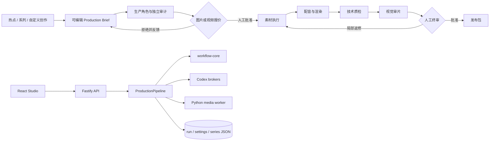

# VideoFactory

VideoFactory 是面向单人创作者的本地优先短视频 Creative OS。它把热点与系列选题、可编辑 Brief、模型与 Provider 路由、逐镜素材方案、配音与渲染、技术/视觉审片、人工返修和发布包放在同一条可恢复、可审计的生产链中。

当前正式操作入口是 React/Fastify Web Studio。TypeScript 负责工作流、版本、审批、成本与 artifact 治理；Python/FFmpeg 负责媒体执行；宿主机 Codex broker 负责需要语义判断的生产角色。

## 当前生产原则

- 图片和视频按导演最终选中的逐镜方案报价。没有全局或单视频硬费用上限，任何计费 Provider 都必须在调用前获得人工确认。
- MiniMax TTS 自动执行并按人民币记账，不弹素材报价；GLM-5.3-Flash 视觉审片使用 Code Plan，不产生现金报价。
- 拒绝报价只保存结构化反馈。只有用户主动选择重新规划，导演才会生成新方案和新报价。
- 图库为空、下载失败、生成失败或复用失败都会让对应节点明确停止，不能用说明卡伪装成功。
- `editorial_card` 只有在导演明确选择 `local-editorial-v1` 时才是合法成片内容，且不能出现内部工作流术语。
- `REUSE_ONLY scene N` 复用更早且已物化的母片，不重新搜索、生成或计费，也不能虚构新的动作或画面状态。
- Agent 负责提案，程序负责可计算事实，用户保留费用审批、节点修改、局部返修和最终审片权。

## 系统结构



主要边界：

- `packages/workflow-core`：DAG、节点、Provider、artifact、intervention 与审批合同。
- `packages/production-pipeline`：生产角色、逐镜路由、报价、run checkpoint、revision/CAS、返修和发布包。
- `apps/studio`：Creator Studio UI、API、持久化服务与生产 worker。
- `apps/codex-broker`：OpenAI Code Plan 与智谱 GLM Code Plan 的宿主机 Unix socket bridge。
- `src/video_factory`：Python 媒体 worker、素材准备、配音、渲染和确定性媒体检查。

## 开发环境

要求 Node.js 22、Python 3.11、FFmpeg 和 ffprobe。macOS 本地确定性配音还需要系统 `say`。

```bash
cd /Users/jinkun.wang/work_space/veidofactory
npm install
make setup-local-runtime
make setup-local-trends
make studio-local
```

打开 [http://127.0.0.1:4317](http://127.0.0.1:4317)。`make studio-local` 会检查本机 Codex 登录、启动两个 broker，再启动 Studio。只调试不依赖 broker 的确定性路径时可运行：

```bash
npm run studio:dev
```

本地热点服务默认只绑定 `127.0.0.1`：

- TrendRadar：`8080`
- TrendRadar MCP：`3333`
- NewsNow：`4444`
- DailyHotApi：`6688`
- RSSHub：`1200`

状态检查：

```bash
make local-trends-status
make codex-broker-status
```

## Provider 配置

从示例创建本地配置：

```bash
cp .env.example .env
```

`.env`、`.env.local`、运行数据和所有密钥都被 Git 忽略。Studio 只返回能力是否就绪，不会通过 API 或资源页面回传密钥。

常用外部能力：

- Pexels：`PEXELS_API_KEY`
- Seedream / Seedance：`ARK_API_KEY` 与对应 model/估价配置
- MiniMax 视频与 TTS：`MINIMAX_API_KEY` 与对应 model/估价配置
- Wan：`DASHSCOPE_API_KEY`、workspace、model 与估价配置

图片和视频估价用于生成保守的逐镜报价，不冒充厂商实时账单，也不构成整片预算上限。

## 验证

完整自动化门禁：

```bash
make test
```

真实媒体 E2E：

```bash
make test-e2e
```

`make test` 覆盖 Python、TypeScript、Studio、broker、生产 build 和 package smoke。真实媒体 E2E 会调用 FFmpeg、ffprobe 和本地音频能力，不是 mock 测试。

不需要外部 API key 的容器/媒体 smoke 使用 `examples/briefs/linux-container-smoke.json`。其中本地 editorial card 是测试 brief 的显式创作选择，不是生产失败 fallback。

## 部署

生产发布只走：

```text
feature branch -> Pull Request -> GitHub Actions -> Alibaba ECS
```

`main` push 触发依赖安全检查、完整测试/build、Linux 容器成片 smoke，然后以该 GitHub commit SHA 部署到阿里云。部署脚本同时验证应用 HTTP health 和两个 broker Unix socket；失败会回滚。不要通过 SSH 手工覆盖生产代码。

详见 [生产部署指南](docs/guides/production-deployment.md)。

## 文档

- [Web Studio 与完整用户流程](docs/guides/web-studio.md)
- [生产工作流与 Provider 边界](docs/guides/production-workflow.md)
- [生产部署](docs/guides/production-deployment.md)
- [视觉与交互规范](DESIGN.md)
- [领域语言](CONTEXT.md)
- [架构决策](docs/adr/)
- [Loop 工程方法](docs/loop-engineering.md)
- [项目演进摘要](docs/HISTORY.md)
- [当前费用与严格素材验收记录](docs/loops/022-spend-approval-and-strict-assets-results.md)

历史实现计划、过期视觉方案和一次性验收报告不再保留在当前工作树；需要考古时从 Git 历史读取，清理前基线为 `2d4f842b160801925115acbae9d1e536079334c6`。

## 当前边界

- 发布包和多平台合规编排已经存在，但真实平台上传仍由人工完成。
- 平台表现连接器尚未接入；真实发布数据仍需外部记录。
- 当前持久化和 execution lease 面向单机 ECS，不是多实例分布式协调方案。
- 新批准的付费成片仍必须逐条执行帧数、时长、黑帧、逐片段画面、视觉一致性和内部术语检查。
