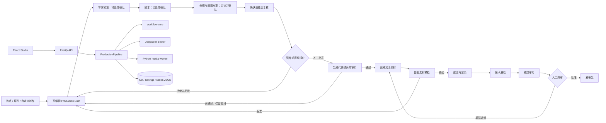

# VideoFactory

VideoFactory 是面向单人创作者的本地优先短视频 Creative OS。它把热点与系列选题、可编辑 Brief、模型与 Provider 路由、逐镜素材方案、配音与渲染、技术/视觉审片、人工返修和发布包放在同一条可恢复、可审计的生产链中。

当前正式操作入口是本地 React/Fastify Web Studio。TypeScript 负责工作流、版本、审批、成本与 artifact 治理；Python/FFmpeg 负责媒体执行；宿主机 DeepSeek broker 负责需要语义判断的生产角色。`codex-broker` 是保留的历史目录名，不表示新制作需要 Codex CLI 或 OpenAI 账号。

## 当前生产原则

- 图片和视频按导演最终选中的逐镜方案报价。没有全局或单视频硬费用上限，任何计费图片或视频 Provider 都必须在调用前获得人工确认。
- MiniMax TTS 自动执行并按人民币记账，不弹素材报价；DeepSeek 视觉审片走订阅额度，不产生现金报价。
- 选题推荐不是热榜搬运：系统会在有界、安全的读取规则下提取热点原文，再把可追溯段落交给总编；总编必须同时判断受众价值、来源可靠性、可拍性和适合的视频形态。读不到正文时会如实标注，不能把标题当作已核实事实；模板目前不参与新制作。
- 新制作先生成导演初案，随后依次生成脚本、分镜与画面方案。每个阶段都停在可恢复的讨论工作台，允许解释、比较备选和多轮修改；只有用户明确确认当前版本才进入下一个阶段，确认分镜后才形成正式执行方案与报价。
- 拒绝报价只保存结构化反馈。只有用户主动选择重新规划，导演才会生成新方案和新报价。
- 成片被打回后，新制作会继承上一版模型、画面来源、声音和导演配置；审片 finding 会按脚本、导演方案和画面素材三类预填并真正进入对应生产输入。历史模板快照只读保留，不再进入返工生产合同。
- 只有人工备注、没有结构化 finding 的打回也会形成可执行范围：备注明确镜号时锁定这些镜头及必要复用依赖，未写镜号时按上一版完整镜头处理，不能产生空范围返工。
- 图库为空、下载失败、生成失败或复用失败都会让对应节点明确停止，不能用说明卡伪装成功。
- 质量检查分为付费前方案审计、生成路线试片、整批素材预检、最终成片审片。每条生成路线先审代表镜头，通过后才继续花费；试片直接用于正式素材，不另买一份。失败保留已生成素材，修改方案后重新报价。
- 整批素材预检在配音与渲染前执行；可读文字、乱码、水印、内部术语，以及与镜头要求不符的主体或动作都会阻断下游。仅说明证据边界的 info 提示保留在报告中，不自动变成付费返工镜头。
- 新制作使用 DeepSeek 单模型审片，并保留独立角色复核与人工终审。没有有效回执不能冒充审片完成。历史双审证据只读保留，不恢复退役的 GPT/Codex 生产调用。
- 模型节点保存一个首选模型，同能力下其余健康模型作为有序候选；请求未受理时的连接、超时、限流、容量或模型不可用，以及原请求已明确结束且由 Broker 结构化归类的基础设施故障或模型无输出，才允许切换。已受理但结果不确定、结构/业务/内容安全/审计失败都不会被替补模型掩盖。
- 声音设置保留演员、语速、停顿和已有母带处理，并按当前真实配音 Provider 能力进入编剧、导演和执行计划；模板不会再覆盖声音选择，也不会虚构尚未接入的音乐或音效轨。
- `editorial_card` 只有在导演明确选择 `local-editorial-v1` 时才是合法成片内容；正式卡片由作品内容生成，不会因英文 query 命中硬编码规则而改写成内部工作流术语。
- `REUSE_ONLY scene N` 复用更早且已物化的母片，不重新搜索、生成或计费，也不能虚构新的动作或画面状态。
- Agent 负责提案，程序负责可计算事实，用户保留费用审批、节点修改、局部返修和最终审片权。
- 默认用途是个人娱乐、非商业创作；允许非商业使用的素材不会仅因禁止商用而被排除。仍须遵守具体的剪辑、公开发布和署名条件。
- 费用界面区分“报价授权金额”和“已记录费用”；配置费率只是本地核算依据，不冒充服务商确认账单。
- 面向创作者的界面使用“制作步骤、服务商、来源核验、逐镜自动调度”等可理解用语；`Node`、`Provider`、`gate` 等术语只保留在工程合同与审计记录中。

## 系统结构



主要边界：

- `packages/workflow-core`：DAG、节点、Provider、artifact、intervention 与审批合同。
- `packages/production-pipeline`：生产角色、逐镜路由、报价、run checkpoint、revision/CAS、返修和发布包。
- `apps/studio`：Creator Studio UI、API、持久化服务与生产 worker。
- `apps/codex-broker`：当前 DeepSeek 宿主机 Unix socket bridge；保留历史协议目录名。
- `src/video_factory`：Python 媒体 worker、素材准备、配音、渲染和确定性媒体检查。

## 开发环境

要求 Node.js 22、Python 3.11、FFmpeg 和 ffprobe。macOS 本地确定性配音还需要系统 `say`。

```bash
cd video-factory
npm install
make setup-local-runtime
make setup-local-trends
make studio-local
```

打开 [http://127.0.0.1:4317](http://127.0.0.1:4317)。`make studio-local` 使用本地 DeepSeek 配置启动一个 broker，再启动 Studio；默认凭据文件由 `scripts/studio-dev-with-codex.sh` 指向 `.local/secrets/deepseek.env`，可用 `DEEPSEEK_ENV_FILE` 指定。无需 Codex CLI 登录。只调试不依赖 broker 的确定性路径时可运行：

```bash
npm run studio:dev
```

本地热点服务默认只绑定 `127.0.0.1`：

- TrendRadar：`8080`
- TrendRadar MCP：`3333`
- NewsNow：`4444`
- DailyHotApi：`6688`
- RSSHub：`1200`

状态检查：

```bash
make local-trends-status
curl --fail --unix-socket .local/runtime/deepseek-codex/worker.sock http://localhost/health
```

## Provider 配置

从示例创建本地配置：

```bash
cp .env.example .env
```

`.env`、`.env.local`、运行数据和所有密钥都被 Git 忽略。Studio 只返回能力是否就绪，不会通过 API 或资源页面回传密钥。

常用外部能力：

- Pexels 图片/视频：`PEXELS_API_KEY`
- Pixabay 图片/视频：`PIXABAY_API_KEY`
- Unsplash 图片：`UNSPLASH_ACCESS_KEY`；保留作者署名、CDN 预览和采用时的下载事件。仅图片，不提供视频；开发额度与正式应用审核由 Unsplash 决定。
- Seedream / Seedance：`ARK_API_KEY`；Seedance 另需对应 model/估价配置
- MiniMax 视频与 TTS：`MINIMAX_API_KEY` 与对应 model；TTS 保留后台核算估价
- Wan：`DASHSCOPE_API_KEY`、workspace 与当前已接入的 model

图片和视频规格用于生成保守的逐镜报价，不冒充厂商实时账单，也不构成整片预算上限。Seedream、MiniMax Hailuo 与 Wan 的内建模型按已审核规格报价；Seedance 和显式自定义模型仍由部署配置提供估价。

素材库显示已经归档的素材；外部来源在“创作设置 → 画面来源”查看。国内摄图网、站酷海洛已核实正式 API，但**尚未接入生产采购**，不能把普通会员或官网链接当成可用接口。见[素材来源配置指南](docs/guides/stock-sources.md)。

## 验证

完整自动化门禁：

```bash
make test
```

真实媒体 E2E：

```bash
make test-e2e
```

`make test` 覆盖 Python、TypeScript、Studio、broker、生产 build 和 package smoke。真实媒体 E2E 会调用 FFmpeg、ffprobe 和本地音频能力，不是 mock 测试。

不需要外部 API key 的容器/媒体 smoke 使用 `examples/briefs/linux-container-smoke.json`。其中本地 editorial card 是测试 brief 的显式创作选择，不是生产失败 fallback。

## 部署

个人开发使用 `main` 主分支，禁止强推和删除。普通推送触发 GitHub Actions 的依赖安全检查、完整测试、构建与 Linux 容器成片 smoke；两项 CI 作业通过后，按该提交的精确 SHA 部署到阿里云。

部署使用宿主机 DeepSeek broker 和 Docker Studio，验证服务身份及应用健康；切换失败则回滚。密钥、工作区和本地 QA 记录不进 Git。详见[生产部署指南](docs/guides/production-deployment.md)。

## 文档

- [素材来源配置](docs/guides/stock-sources.md)
- [生产部署](docs/guides/production-deployment.md)
- [视觉与交互规范](DESIGN.md)
- [领域语言](CONTEXT.md)

历史实现计划、过期视觉方案和一次性验收报告不再保留在当前工作树；需要考古时从 Git 历史读取，清理前基线为 `2d4f842b160801925115acbae9d1e536079334c6`。

## 当前边界

- 发布包和多平台合规编排已经存在，但真实平台上传仍由人工完成。
- 平台表现连接器尚未接入；真实发布数据仍需外部记录。
- 当前持久化和 execution lease 面向单实例（本地或 ECS），不是多实例分布式协调方案。
- 新批准的付费成片仍必须逐条执行帧数、时长、黑帧、逐片段画面、视觉一致性和内部术语检查。
- 当前生产渲染的时长合同固定为 30fps；例如 24 秒成片必须严格输出 720 帧，并在整条时间线上持续有画面。
