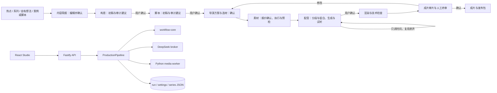

# VideoFactory

VideoFactory 是面向单人创作者的短视频制作工具。你可以从热点、系列、自有想法或案例 / 脚本开始，逐步完成构思、脚本、选材、配音、渲染和审片。每个关键步骤由你确认，结果和修改记录可以回看。

当前版本为 V1 个人试用版，支持本地运行和单实例云端部署。操作界面是 Web Studio；TypeScript 管理制作流程、版本、确认与费用记录，Python 和 FFmpeg 处理媒体，宿主机模型服务处理文本与内容理解请求。

四个入口已完成本地受控声音全链验证，包括真实 FFmpeg 渲染和播放。受控验证不代表真实配音韵律、内容质量或服务商稳定性已经全面验收，这些仍需要实际试用。

## 当前生产原则

- **由用户推进。** 构思、脚本和导演方案依次生成，初稿附一轮内容审计。你可以采用，也可以多选建议、补充自己的要求后修改。修订稿不会自动再审；是否再次审计或进入下一步由你决定。
- **质量意见不替代决定。** 内容评分、审片建议和未复核风险会如实展示。可恢复问题保留修改、换来源或知情继续的出口；没有真实素材、音轨或成片时，不用占位内容伪装成功。
- **费用按能力说明。** 付费图片和视频先报价并由用户确认；配音按配置自动计费，不逐笔弹素材报价。授权金额、配置估算与已记录费用分开显示，服务商实付以账单为准。
- **请求不盲目重发。** 只有未受理或已明确结束、允许切换的故障才使用其他候选模型；请求结果不确定时查询原请求，不重新购买。
- **返工有范围、有版本。** 修改要求进入对应生产输入。没有镜号的人工返工意见也会形成有效范围；旧稿件和产物保留，但不替代新版确认。已物化的镜头可以明确复用，不重复生成或计费。
- **配音可先规划、后调时间。** 生成前编辑分段和留白；生成后可复用原声调整位置与静默，不重新调用配音服务。调整后回到试听确认，已有下游成片不继续当作当前版本。
- **视频形式在创建时选择。** 四个入口共用解说视频与角色剧情。角色剧情可编辑角色、台词和各角色的系统音色，按发言顺序分别配音；不包含口型同步、声音克隆或多人抢话混音。真实人物一致性和声音表现需结合样片判断。
- **来源和许可可追查。** 热点读不到正文时明确标注；素材保留作者、来源和许可。默认面向个人非商业创作，但剪辑、署名和公开发布仍须遵守具体条款。
- **发布由用户完成。** 系统提供成片与发布包，当前不自动上传外部平台。声音、音乐和音效只展示实际接入的能力。

具体操作见[制作流程与声音调整](docs/guides/production-workflow.md)。

## 系统结构


```mermaid
flowchart LR
    S[热点 / 系列 / 自有想法 / 案例或脚本] --> B[内容简报：编辑并确认]
    B --> TREAT[构思：初稿与审计建议]
    TREAT -->|用户确认| SCRIPT[脚本：初稿与审计建议]
    SCRIPT -->|用户确认| PLAN[导演方案与选材：确认]
    PLAN --> M[素材：报价确认、执行与预检]
    M --> V[配音：分段与留白、生成与试听]
    V -->|只调时间，复用原声| V
    V -->|用户确认| RENDER[渲染与技术检查]
    RENDER --> REVIEW[成片审片与人工终审]
    REVIEW -->|确认| P[成片与发布包]
    REVIEW -->|修改| PLAN

    C[React Studio] --> API[Fastify API]
    API --> PIPE[ProductionPipeline]
    PIPE --> CORE[workflow-core]
    PIPE --> BROKER[DeepSeek broker]
    PIPE --> WORKER[Python media worker]
    PIPE --> STORE[(run / settings / series JSON)]
```

主要边界：

- `packages/workflow-core`：DAG、节点、Provider、artifact、intervention 与审批合同。
- `packages/production-pipeline`：生产角色、逐镜路由、报价、run checkpoint、revision/CAS、返修和发布包。
- `apps/studio`：Creator Studio UI、API、持久化服务与生产 worker。
- `apps/codex-broker`：宿主机模型服务、接入协议与耐久请求记录，通过 Unix socket 与 Studio 通信。
- `src/video_factory`：Python 媒体 worker、素材准备、配音、渲染和确定性媒体检查。

## 开发环境

要求 Node.js 22、Python 3.11、FFmpeg 和 ffprobe。macOS 本地确定性配音还需要系统 `say`。

```bash
cd video-factory
npm install
make setup-local-runtime
make setup-local-trends
make studio-local
```

打开 [http://127.0.0.1:4317](http://127.0.0.1:4317)。`make studio-local` 使用本地 DeepSeek 配置启动模型服务，再启动 Studio；默认凭据文件由 `scripts/studio-dev-with-codex.sh` 指向 `.local/secrets/deepseek.env`，可用 `DEEPSEEK_ENV_FILE` 指定。只调试不依赖模型服务的确定性路径时可运行：

```bash
npm run studio:dev
```

本地热点服务默认只绑定 `127.0.0.1`：

- TrendRadar：`8080`
- TrendRadar MCP：`3333`
- NewsNow：`4444`
- DailyHotApi：`6688`
- RSSHub：`1200`

状态检查：

```bash
make local-trends-status
curl --fail --unix-socket .local/runtime/deepseek-codex/worker.sock http://localhost/health
```

## 模型与素材配置

从示例创建本地配置：

```bash
cp .env.example .env
```

`.env`、`.env.local`、运行数据和所有密钥都被 Git 忽略。Studio 只返回能力是否就绪，不会通过 API 或资源页面回传密钥。

模型库与角色默认分开管理。添加模型时选择实际协议和能力，再设置角色默认；新设置不会覆盖已经创建的制作。详见[模型与声音审片配置](docs/guides/model-configuration.md)。

常用外部能力：

- Pexels 图片/视频：`PEXELS_API_KEY`
- Pixabay 图片/视频：`PIXABAY_API_KEY`
- Unsplash 图片：`UNSPLASH_ACCESS_KEY`；保留作者署名、CDN 预览和采用时的下载事件。仅图片，不提供视频；开发额度与正式应用审核由 Unsplash 决定。
- Coverr 视频：`COVERR_API_KEY`；Demo 免费额度每小时 50 次，保留来源与作者信息，只使用官方签名下载链接。
- Flickr 图片：`FLICKR_API_KEY`；需要正式 API 权限，逐文件保留许可与署名。
- Seedream / Seedance：`ARK_API_KEY`；Seedance 另需对应 model/估价配置
- MiniMax 视频与 TTS：`MINIMAX_API_KEY` 与对应 model；TTS 保留后台核算估价
- Wan：`DASHSCOPE_API_KEY`、workspace 与当前已接入的 model

图片和视频规格用于生成保守的逐镜报价，不冒充厂商实时账单，也不构成整片预算上限。Seedream、MiniMax Hailuo 与 Wan 的内建模型按已审核规格报价；Seedance 和显式自定义模型仍由部署配置提供估价。

素材库显示已经归档的素材；外部来源在“创作设置 → 画面来源”查看。国内摄图网、站酷海洛已核实正式 API，但**尚未接入生产采购**，不能把普通会员或官网链接当成可用接口。见[素材来源配置指南](docs/guides/stock-sources.md)。

## 验证

完整自动化门禁：

```bash
make test
```

真实媒体 E2E：

```bash
make test-e2e
```

`make test` 覆盖 Python、TypeScript、Studio、broker、生产 build 和 package smoke。真实媒体 E2E 会调用 FFmpeg、ffprobe 和本地音频能力，不是 mock 测试。

不需要外部 API key 的容器/媒体 smoke 使用 `examples/briefs/linux-container-smoke.json`。其中本地 editorial card 是测试 brief 的显式创作选择，不是生产失败 fallback。

## 部署

个人开发使用 `main` 主分支，禁止强推和删除。普通推送触发 GitHub Actions 的依赖安全检查、完整测试、构建与 Linux 容器成片 smoke；两项 CI 作业通过后，按该提交的精确 SHA 部署到阿里云。

部署使用宿主机 DeepSeek broker 和 Docker Studio，验证服务身份及应用健康；切换失败则回滚。密钥、工作区和本地 QA 记录不进 Git。详见[生产部署指南](docs/guides/production-deployment.md)。

## 文档

- [素材来源配置](docs/guides/stock-sources.md)
- [制作流程与声音调整](docs/guides/production-workflow.md)
- [模型与声音审片配置](docs/guides/model-configuration.md)
- [生产部署](docs/guides/production-deployment.md)
- [视觉与交互规范](DESIGN.md)
- [领域语言](CONTEXT.md)
- [版本说明](CHANGELOG.md)

运行现场、历史研发记录、截图和测试日志不随当前公开版本发布。

## 当前边界

- 发布包和多平台合规编排已经存在，但真实平台上传仍由人工完成。
- 平台表现连接器尚未接入；真实发布数据仍需外部记录。
- 当前持久化和 execution lease 面向单实例（本地或 ECS），不是多实例分布式协调方案。
- 配音时间调整不改变原声的文字、音色、语速或情绪，也不是重新合成自然语音。需要改词或重录时回到对应创作步骤，可能产生新的费用。
- 真实声音审片取决于模型是否支持音频输入；未发送真实音频时明确显示未审听，不能用转写或画面抽帧代替。
- 当前生产渲染按 30fps 核对帧数和时长；例如 24 秒成片应输出 720 帧，并在整条时间线上持续有画面。
- 本地自动化通过不代表真实服务商、所有网络环境、内容质量或用户听感已经通过验收。
