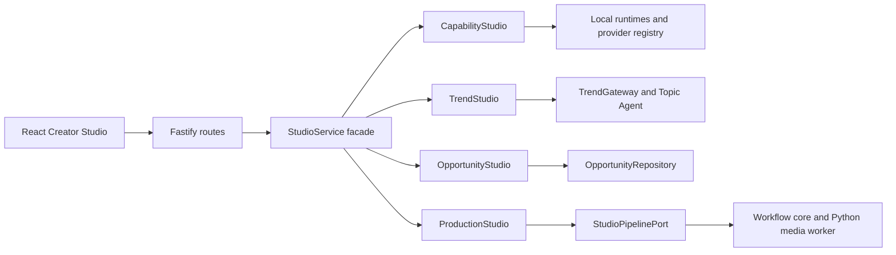

# ADR 003: Studio Deep Module Boundaries

Date: 2026-08-24

## Status

Accepted and implemented in Loop 16.

## Context

Studio 已经同时承担本地运行时发现、Provider 能力、热点聚合、选题管理、生产调度、人工终审、SSE 更新和 artifact 下载。原来的 `StudioService` 把这些行为放在一个类中，路由调用虽然简单，但内部变化会彼此牵连，也不利于单独替换热点或生产实现。

系统仍然是单机优先的个人创作工具。当前不需要微服务、消息总线或通用 DI 容器；需要的是在单进程内形成清楚、可测试、可替换的领域边界。

## Decision

- 保留 `StudioService` 作为路由层唯一稳定入口和 composition root。
- `CapabilityStudio` 负责运行时探测、Provider 列表、本地音色和试听。
- `TrendStudio` 负责趋势源、热点服务、信号和本地选题 Agent。
- `OpportunityStudio` 负责选题生命周期与持久化。
- `ProductionStudio` 负责生产调度、人工决定、运行订阅、DTO 映射和 artifact 安全边界。
- 生产模块只依赖 `StudioPipelinePort`，选题模块只依赖 `StudioOpportunityRepository`；跨模块查询通过窄回调传入。
- HTTP 路由、共享 API schema 和底层 pipeline contract 保持不变。

## Consequences

收益：

- 路由层不感知模块组装，API contract 没有迁移成本。
- 热点、选题、能力和生产可以独立测试与替换。
- 付费模型接入只扩展 Provider 与 adapter，不需要修改工作流核心。
- artifact 路径校验和人工终审仍集中在生产边界内。

约束：

- 当前仍是进程内组合，不解决多机调度和分布式一致性。
- `ProductionStudio` 保留 run DTO 映射，因为它属于生产边界；只有映射规则出现第二个调用方时才进一步抽离。
- 新能力应先判断所属领域，不得重新堆回 facade。
