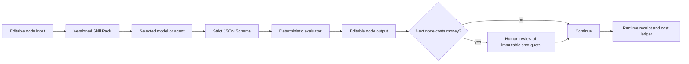

# ADR 004: Agent Production Skill Packs

Date: 2026-08-28

## Status

Accepted. The prompt contract, deterministic gate, runtime receipt, spend gate, and editable node delivery are implemented. Semantic asset ranking and optional post-processing remain extension points.

## Context

VideoFactory 的节点已经由选题总编、编剧、视觉导演、素材导演、声音演员、渲染工程师和审片员协作完成。问题不再是“有没有 Agent”，而是 Agent 的工作能否稳定复现、被程序验收、被用户修改，并在付费之前停下来。

只增加更长的 prompt 不能解决这个问题。模型会产出有创意但不可执行的描述，也可能口头遵守规则却交付重复镜头、过长图库查询或自相矛盾的审片结论。

## Decision

每个 Agent 角色使用一个版本化 **Skill Pack**。它不是新的工作流引擎，也不是把 GitHub 仓库直接装进生产容器，而是当前 broker task definition 的完整生产合同：

1. `directive`：角色边界、创作原则和禁止事项。
2. `task`：本次任务目标。
3. `outputRules`：机器和用户都能理解的交付规则。
4. JSON Schema：字段、枚举、边界和结构校验。
5. deterministic evaluator：编号连续性、重复路由、审批阈值等无需模型判断的规则。
6. fixtures/tests：正例、反例和回归测试。
7. runtime receipt：实际 provider、model、prompt version、schema version、耗时和成本证据。

模型负责创意判断，程序负责可计算事实。任何模型都不能自行批准一个低于质量阈值的结果。

## Asset Decision Boundary

素材节点采用三层结构：

- Discovery：Pexels、Pixabay、本地素材或未来 Provider 返回候选。
- Ranking：当前保留 Provider 原始相关性顺序并展示最多 6 个候选；未来通过 `AssetSemanticRanker` 接入外部多模态 embedding 或视觉 Agent。
- Materialization：只有最终候选在后端下载。临时下载 URL 不进入节点交付、浏览器或长期候选报告。

图库是检索，不是生成。需要精确多步表演、严格物件变化或特定界面操作的镜头，不能因为免费就假装图库能够兑现。导演应改用生成式 Provider、简化为诚实的说明画面，或在付费门前交给用户决定。

## Preview And Spend Policy

- 所有节点输入、输出和实际能力回执都可见；用户修改后生成新版本并使下游失效。
- 每个付费图片/视频节点前必须停止，展示本次实际输入版本、Provider、逐镜不可变报价和已有免费产物；没有视频级硬费用上限。
- 视频生成按首批镜头预览后再放量；首批不通过时只重做受影响镜头。
- 成片视觉审查按渲染时间线抽取首屏和逐镜中点，不把转场帧当作镜头证据。

## Reference And Style Policy

参考视频只提取可复用的制作语法：镜头尺度、节奏、构图、色彩、转场、声音和动作结构。系统不得默认下载无权使用的视频，也不得复制人物、品牌、受版权保护的画面或以在世导演姓名直接承诺模仿。

“导演风格”继续使用抽象 craft profile，例如纪实观察、纸张拼贴、克制商业说明和动态信息设计。参考素材必须记录来源、权利状态和用户确认。

## Post-processing Boundary

清晰度增强、降噪、插帧和剪映草稿导出属于独立后处理 Provider，不嵌入渲染核心。每个后处理能力都必须声明：

- 输入输出规格与最大文件大小；
- 是否付费以及按秒/按次估价；
- 是否把媒体上传给第三方；
- 是否会改变帧率、时长、音轨或字幕；
- 可验证的前后对比和失败回退。

## Consequences

收益：角色可以独立演进，模型可以替换，用户能在付费前纠错，审计记录能解释“当时为何这样生成”。

代价：每个新能力都要同时提供 schema、evaluator、预览和测试；不能只接一个 API 就宣称完成。语义素材排名暂时仍依赖人工候选预览，直到外部多模态 ranker 经成本和准确率验证。

## Rejected Alternatives

- 直接搬入另一个项目的整条流水线：会产生第二套工作流、配置和成本账本。
- 在 4 核 8G ECS 部署 WeMM、Whisper large 或视频生成模型：与当前不跑本地模型的约束冲突。
- 把 X 帖子的效果展示当作 API 能力或成本证据：缺少可复现输入、接口条款和账单依据。
- 一次性实现所有垂直视频模板：先用真实账号数据验证模板，再逐个产品化。
