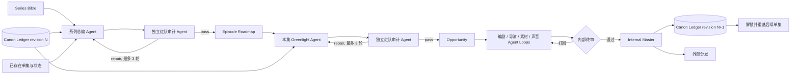

# ADR 005: Series, Episode Roadmap, and Canon Workflow

Date: 2026-08-30

## Status

Accepted and implemented for the first season workflow.

## Context

热点视频是短周期决策：信号、核验、角度、生产。系列视频是长期资产：栏目承诺要稳定，单集有先后关系，已经定版的事实会约束后续创作，未来计划又必须允许调整。把系列实现为“带集数的热点候选”会造成三个问题：入口内容串线、未制作计划污染正史、每集只换标题而没有篇章推进。

影视生产管理通常把 Episode、Sequence/Shot、Task 和 Review 分层；发布型内容管线则把可被下游依赖的版本作为不可变检查点。编剧工作流还会先用 Series Bible 固定故事引擎和长期边界，再逐集拆解、起草、集体审阅和改稿。VideoFactory 采用相同边界，但把 writers' room 中的角色拆成可追踪的 Agent producer / auditor，并保留当前单人创作者和短视频生产的简洁性。

## Decision

系列生产由六层组成：

1. `Series Bible`：栏目承诺、受众、内容支柱、语气、视觉规则和禁止改变项。
2. `Episode Roadmap`：当前季的有序单集计划；每集有独立 viewer promise、hook、payoff 和前后连续性。
3. `Episode Greenlight`：采用前用最新 Bible、Canon 和前集正式交接重新审计本集；旧规划不能因为曾经通过而永久免检。
4. `Opportunity`：创作者采用某一集后形成的生产入口；只有当前可推进且通过 Greenlight 的单集能被采用。
5. `Internal Master`：单集通过内部终审后的不可变成片版本。
6. `Canon Ledger`：只由 Internal Master 的结构化 `canonFacts` 追加；未来路线图、预告、模型推测和外部发布状态都不能提前写入正史。

`series-roadmap` 是独立 Broker task，不复用热点 `topic-ideas`。系列总编产出严格 JSON，独立 `role-audit` 按正史边界、单集独立价值、季篇章递进、连续性、视觉可执行性和经济性审核，最多三轮。Broker 对系列策划和审计均使用配置的最高 audit reasoning effort。

尚未采用的单集允许在路线图中人工修订标题、内容支柱、观众收获、钩子、兑现和前后承接。写入使用 Series revision 做 compare-and-swap；过期页面不能覆盖新路线图。人工版本标记为 `human_override`，不会伪装成原 Agent 已经审计通过，也不会被后台自动规划悄悄覆盖。真正采用前，`系列开拍总编` 先把当前方案作为初始 candidate 交给独立审计 Agent；通过则不改人工内容。若审计认为人工字段存在冲突，系统展示问题与修复建议并退回主创修改，Agent 不能静默覆盖主创确认的字段。只有 Agent 自己生成且尚未被人工接管的草案，才允许在最多三轮中自动修复与复审。每次 Canon 或正式前集交接变化，尚未开拍的相关单集都会变为 `stale`，采用时重新 Greenlight。

连续性拆成两个所有权不同的字段：`inheritedFromPrevious` 是系统从前集 Internal Master 或正式 `toNext` 写入的正史交接，创作者不能在普通编辑表单里覆盖；`fromPrevious` 是本集自己的人工创作约束，系统对账不会按内容相似或文本相等删除它。修改前集 `toNext` 只更新下一集的系统交接并使其审计过期，不再覆盖下一集人工写下的要求，也不再保留虚假的旧审计结论。

服务端只信任已采用 Opportunity 的 `seriesId + episodeNumber`。启动生产时会重新构造 `StudioSeriesProductionContext`；浏览器传入的完整上下文只用于预览，不能覆盖服务端 Bible、Canon 或 revision。每个下游角色得到同一份版本化系列上下文，并保留自己的生成、独立审计和自动修复循环。

生产开始前先为单集写入唯一 `runReservation`，再把 reservation ID 写入服务端构造的 run 元数据并 dispatch 真实任务，最后把 reservation 原子确认成 `runId`。不同 idempotency key 也不能让同一集并发开拍。dispatch 前失败可以释放 reservation；一旦拿到真实 `runId` 就不能释放，而要利用 run 中可信的 `seriesId + episodeNumber + opportunityId + productionReservationId` 精确对账恢复，旧失败尝试不能误绑新预约，避免孤儿任务和重复付费。若服务在 dispatch 前崩溃且始终找不到匹配 run，reservation 在 15 分钟保守租期后才允许被对账回收；未到期时绝不抢占。上游节点人工改稿时会持有同样持久化、可跨进程观察的 `editLease`；下游采用、Greenlight 与预约开拍都会检查该租约，而上游获取租约也会检查下游是否已经采用或预约，封闭“刚检查完就并发开拍”的竞态窗口。

Canon Fact 不是路线图标题、viewer promise、下一集预告或最后一句旁白的推断副本。系列编剧必须输出 1–8 条结构化 `canonFacts`，只描述本集已经建立且允许后集依赖的事实；这份清单会作为终审的显式、可读输入。只有最终生效脚本与终审批准的 `canonFacts` 完全一致、终审之前所有实际节点均成功且无 stale、run 成为 Internal Master 时才写入 Canon，并记录 `sourceRunId`、run revision 和 effective output version IDs。run 被人工修订为 stale、失败、拒绝或消失时，对应 Canon 会撤回，传播到后集的旧 memory summary 同时清除；同一 run 只接受单调递增的 revision，延迟到达的旧快照不能复活已经撤回的 Canon。前集重新形成有效 Canon 前，后集即使已经采用也不能占用生产位。后集已经采用或进入制作后，上游定版集不能被直接改写；已发布集只能通过更正集或正式修订流程修正。

## Entry Isolation

热点、系列和自定义只在首页作为三个入口并列。进入某个入口后，`/api/opportunities` 与 `/api/runs` 必须按 `origin` 在服务端过滤；前端过滤只作为第二层防护。候选采用请求显式携带 `origin`，服务端按该入口查找并校验，不能再从候选 ID 前缀猜来源。三个入口可以共享 ProductionPipeline，但不能共享当前页面的候选、机会或记录集合。

## Failure Policy

Codex 不可用、输出结构错误或三轮未通过时，系列创建仍可生成明确标注的 deterministic fallback 草案，保证创作者能继续查看和编辑路线图。fallback 记录 Provider、模型、Prompt Pack、审计状态和原因，不能伪装成 Agent 审核通过；在独立 Greenlight Agent 恢复并审计通过前，repository 和应用服务都会拒绝采用该集，因此草案不会绕过审计进入生产。

生产 run 明确失败、拒绝或被合规删除后，单集回到 `selected`，保留 `attemptRunIds` 作为历史，但释放当前 `runId`，允许用户从同一个已采用机会重试。若计费 Provider 已受理请求、进程却在保存 task ID 或结果前中断，结果被视为 `outcomeUncertain`：单集进入 `paused` 并保留原 `runId`，禁止另起一次付费制作，只允许原任务对账或沿用原 operation request ID 恢复。已经成为 Canon 来源的 Internal Master 不能永久删除，只能归档。Agent loop 的 `exhausted` checkpoint 是终态；同一 checkpoint key 不会悄悄再开启额外三轮，重新审计必须显式产生新 key。

迁移旧系列时，创作者可以把一条历史成功成片明确绑定到某一集。旧任务没有结构化 `canonFacts` 时，系统不得从标题或旁白猜测正史；该集会标记为已恢复并显示“请人工补充承接”的连续性提示。这个显式迁移确认可以解锁下一集，但不会向 Canon Ledger 写入任何虚构事实。

当前 `JsonSeriesStore` 同时使用进程内写队列、成熟 `proper-lockfile` 跨进程锁和临时文件原子 rename，适用于当前单机 ECS。旧版或不完整的早期数据（包括缺失单集记录的 v1 / v2 文件）会依据已经推进的集数补成历史已采用单集，等待旧 run 对账恢复，不再静默丢失或提前解锁后集。若扩展到多实例或共享存储，必须把 repository 换成支持事务、唯一约束和 compare-and-swap 的数据库实现；不能把单机文件锁误当作分布式锁。

## Consequences

收益：系列成为可长期经营、可恢复、可审计的内容资产；后续单集只依赖真实定版内容；模型或 UI 可以替换而不破坏正史。

代价：创建或补齐路线图会增加 Agent 调用时间；季重排和 Series Bible 人工修订仍需要独立产品流程，不能通过直接编辑 JSON 偷渡。当前支持单条尚未开拍路线图的人工修订，以及从最终生效脚本提炼带版本来源的 Canon；它们都不冒充整季重排。

## Sources

- Kitsu TV production structure: https://kitsu.cg-wire.com/tvshow/
- AYON publish checkpoints: https://help.ayon.app/en/articles/7070980-about-ayon-pipeline
- Anthropic evaluator-optimizer workflow: https://www.anthropic.com/engineering/building-effective-agents
- Anthropic agent evaluations: https://www.anthropic.com/engineering/demystifying-evals-for-ai-agents
- LangGraph persistence and human-in-the-loop checkpoints: https://docs.langchain.com/oss/python/langgraph/persistence
- StudioBinder Series Bible and story engine: https://www.studiobinder.com/blog/tv-show-pitch-bible-template/
- BBC Academy writers' room, outline, and head-writer review workflow: https://downloads.bbc.co.uk/academy/academyfiles/Writing_TV_Drama_BBC_Academy_Podcast_Transcript_%5B230217%5D.pdf
