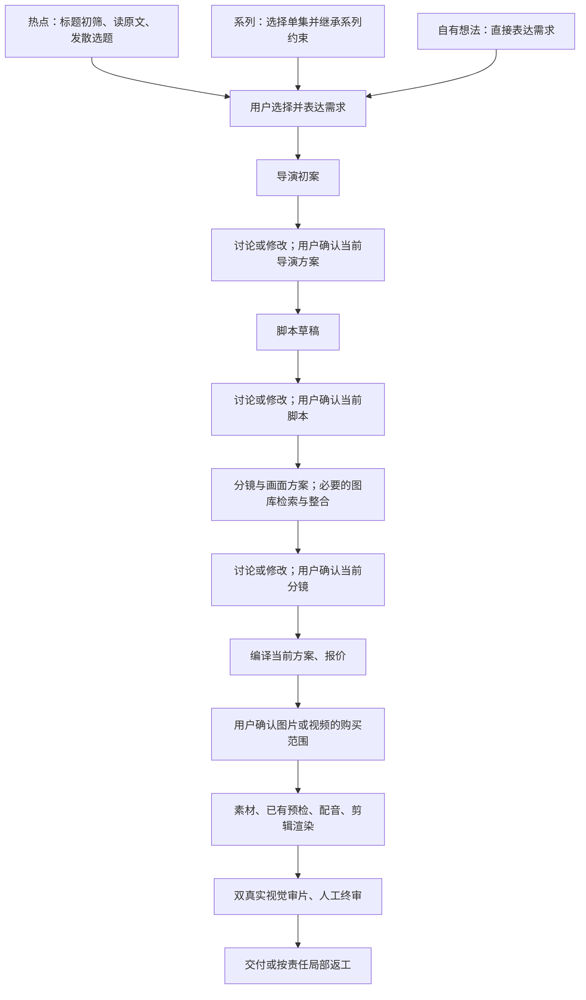

# 01 产品规则与用户交互

这是本轮必须实现的产品合同。技术参数由 02/03 文件约束；不能用提示词替代后端边界。

## 1. 主线与保留项

以前的问题是需求未经讨论就一路自动推进，误解会放大到脚本、分镜和购买。现在改为：**先与用户达成创作共识，再自动执行确定的方案**。

讨论环节可停留任意轮，用户满意也可直接确认。图中箭头均须符合对应确认和授权条件，不是程序可自行跳过的说明图。

R11-P01：三个入口保留，由用户选择，不根据句子擅自切入口；下游汇入同一规划/执行链。

R11-P02：模板不参与新制作、讨论、规划、审计及新返工；保留模板 CRUD、历史。禁止后台补固定三拍套路、固定镜头比例或默认音效来替代模板。原声音、模型/备选、参考语法、时间轴、素材库、复用、局部返工、双审等能力保留。

R11-P03：时长使用范围，具体长度由叙事与已支持媒体能力决定。不能按固定秒数截掉承诺、补说明卡。若超出用户范围，回到讨论提出原因与新范围，不自行放宽。

## 2. 要求与建议

R11-P04：用户明确填写、修改、明确采纳的要求才是创作约束。系统预填、自动 visualPlan、参考片方法、角色提议仅是建议。明确采纳不要求用户重打一遍文字。

- 没填 visualIntent 时保持缺省；自动建议显示在“可参考的方向”，不拷贝成“你的要求”。
- 来源限制、事实、当前能力、版权、付费安全不能被创作要求覆盖；冲突要解释。
- 已确认的阶段文档成为下游基线。用户通过讨论明确修改要求后，更新有效要求并保留其原文/来源；不能让旧要求继续与新要求打架。
- 撤销仅撤销本轮草稿修改，不抹去消息或已发生的调用/费用。

## 3. 三阶段讨论

R11-P05：导演初案、脚本、分镜分别有可读草稿与讨论区。草稿生成后正常等待用户，不标为失败，不自动开启下一个创作角色。

R11-P06：区分四种意图：

| 用户意图 | 行为 | 当前方案是否变化 | 是否继续 |
| --- | --- | --- | --- |
| 问原因、请解释 | 当前角色回答、引用相关段落 | 否 | 否 |
| 想比较另一种做法 | 给出可比较备选及取舍 | 否，采用前是备选 | 否 |
| 明确要求改成某种做法 | 生成修订草稿、展示改动并可撤销 | 是，成为待确认版本 | 否 |
| 点击“确认当前方案，继续” | 检查并确认当前版本 | 不暗改内容 | 仅检查通过且版本未变时继续 |

自然语言“就用这个”可以采用明确备选为当前草稿，但不替代页面的阶段确认动作，更不批准付款。意图不清才简短问一句，不让用户先学会结构化命令、JSON 或“操作类型”。

R11-P07：用户决定讨论多少轮、何时继续。不得设置讨论轮数上限或沉默超时自动同意。单条消息长度、单次模型任务期限、结构修复及自动故障重试仍有界；这与用户可多轮讨论不矛盾。

R11-P08：不对每句讨论跑完整独审。生成/修改先做必要结构和已知硬边界检查；用户准备确认时才对该版本做当前角色的独立质量/可制作性检查。检查不通过，说明问题并提供“按建议修改/继续讨论”，不自动修到合格后替用户确认。检查导致新草稿时必须再确认新草稿。

R11-P09：确认严格绑定当前内容、当前上游和当前配置。页面刷新、普通恢复、重启、两窗口操作、重复点击、模型迟到结果都不能绕过确认，也不能把旧确认用到新内容。

## 4. 统一且易用的工作台

R11-P10：优先复用 RunWorkbench、NodeWorkspace、PlanningStagesPanel 的样式和导航，不重建全站 UI。

- 桌面：当前方案与讨论并排，页面上方明确“导演方案 / 脚本 / 分镜”及当前状态；底部一个明确主动作。
- 手机 390px：方案/讨论切换，保留滚动位置与输入草稿；底部动作不遮挡消息、键盘和错误提示。不能横向滚动才能看到确认。
- 导演方案展示观众收益、开头、推进与结尾、视觉与声音方向、需用户决定的缺项；脚本可直接读；分镜按镜头卡展示画面、旁白、预计时长、获取路线和跨镜关系。
- 允许点选段落/镜头作为讨论范围，也可聊全片；显示选中范围且能取消。不引入复杂时间线编辑器。
- 提供少量可选提示，如“开头不够吸引”“解释这个安排”“给我另一个方向”，不是必填问卷。
- 修改后显示新内容和简短变更清单，支持“看改动”“撤销本轮”；不要求用户逐轮重读整个长文。
- 每阶段有同一处模型/备选设置；实际已调用模型与下次选择分开显示。保留已有技能选择，不删旧能力。
- 尚未生成的画面标“画面描述，尚未生成”；可显示已有真实素材及来源，不能伪装预览，也不暗中买图。
- 用户键入时不因自动刷新抢焦点或覆盖输入；发送后保持草稿直到服务端确认受理。失败提供明确恢复动作，不只有“重试”。
- 不默认自动将自由文本的换行当发送；中文输入法组合键不得提交。按钮、键盘、读屏标签使用同一可理解语义。
- 离开再回来、刷新、重启保留已发送讨论、方案、确认状态。未发送草稿仅保存在本机、当前用户和 run/stage 范围，退出登录清除本机草稿，不删服务器历史。

建议文案：

- “导演方案已生成，等你确认。你可以直接继续，也可以先聊聊想改的地方。”
- “正在检查当前方案；检查不会修改你的方案，也不会购买素材。”
- “有两处需要调整，尚未进入下一步。”
- “此版本已被更新，请查看变化后重新确认。”
- “原模型任务仍在处理，查询不会重新生成。”
- “采用此修改会影响脚本和分镜；已有素材保留，新增制作另行报价。”

## 5. 导演、编剧与声音的责任

R11-P11：前期导演负责观众收益、叙事、风格与制作可行性；编剧负责把确认方向变成可朗读、可制作的脚本；视觉导演负责统一的逐镜方案、素材路线和连续性；现有声音执行负责实际配音及已支持声音处理。加强同一角色的交接，不加每步监工 Agent，不新增音乐/SFX/多轨系统。

R11-P12：普通示意镜头，导演可在用户允许且实际支持的图库/生成/复用池内调整路线。脚本中的 stock 是初步路线建议，不天然等于必须实拍。真实取证、用户禁止生成、特定人物/事件素材不能被改成生成。涉及用户已确认的叙事或分镜变化先展示修改；新购买重新报价。

R11-P13：保留原审计历史，但下一轮只有一套有效修改要求。已明确纠正的候选误分类，不再附加原补料命令；真实缺料依然阻断。质量评价与能否开工分开显示。不得凭问号、数字写法、题材词决定作品有无视频价值。

R11-P14：系列 bible/canon/continuity 及本集承诺完整且有界地进入前期导演、编剧、视觉导演及其审计；自动总结不得改写已确认系列事实。

R11-P15：声音配置只有一个有效来源。改语速/停顿后，编剧/导演重新判断节奏与时间；若方案需要变，回到对应讨论点。构思不因纯节奏变动重做；音色/声音处理单改只影响声音下游。保留可用素材，不能一改配音就全部重买。

声音 UI 如实说明 Provider 支持哪些设置：MiniMax 是相对速度映射，不保证精确字/分；Kokoro 未支持的停顿控制不能显示已生效。已有声音意图保留，不虚构音轨。

## 6. 热点阅读与发散

R11-P16：热点标题与热度只用于初筛。入围事件读取原文，形成可追溯事实、背景、不确定项，再由现有总编发散视频角度供用户选。不能只给新闻标题换皮，也不能把来源数量当内容核验。

候选应能看见：为什么值得做、给谁看、观看收益、建议视频表现方式、预计素材难点、哪些事实已读到/仍待核验。表现方式是建议，不恢复模板。

未取得正文显示“仅有标题”；被截断/付费墙/动态页面明确说明；不能称已通读或已核实。可以给受限的主题灵感，但不得把未读文章的细节写成已证实事实。正式事实承诺仍过现有来源门。具体抓取边界见技术方案。

## 7. 执行、成本、返工与恢复

R11-P17：创作确认不等于付费授权。产品默认无全局现金上限；图片/视频按当前可执行计划精确报价和批准，TTS 自动执行并后台记账，订阅文本/审片不弹现金报价。已授权范围内保质量降本；超范围/不足反馈用户，不转说明卡。

R11-P18：用户已确认方向若需改变，回到最早受影响的创作阶段；下游失效范围和保留内容说清楚。下载、配音、渲染等确定执行不增加逐步讨论门。原审片建议按责任预填，局部返工不无故扩大，全片整合后仍审全片。取证不足先补看已有媒体，不能直接重买。

R11-P19：已受理而结果未知只观察原任务，不切备用、不换 requestId、不重新购买。确定未受理或确定失败才能按已有策略恢复；查询/刷新不增加物理调用数。等待用户、排队、模型运行、结构修复、素材处理各自如实展示，不为了提速降模型/思考强度/取证覆盖。

## 8. 未新增的产品决定

“总编纯粹认为吸引力不足时，用户能否强行越过它制作”尚未单独明确授权。本轮移除机械词规则否决、保留已有总编语义判断和现行采用权限，不新增强制越过总编按钮；不影响已明确功能的实施。不得顺势移除来源、真实性或最终质量门。

本轮不换工作流框架/数据库，不造通用聊天平台、版本管理平台或核账平台，不加入数字人/短剧等新生成形态。版本与摘要仅用于当前方案绑定、恢复和防止误授权。
