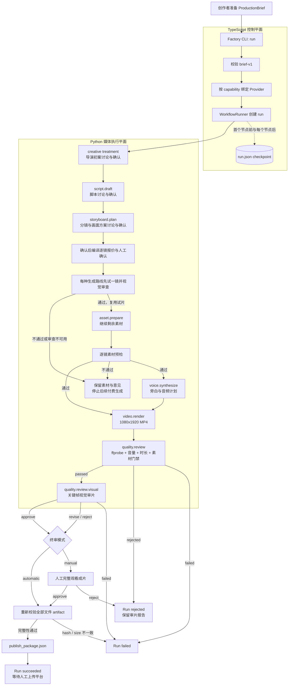
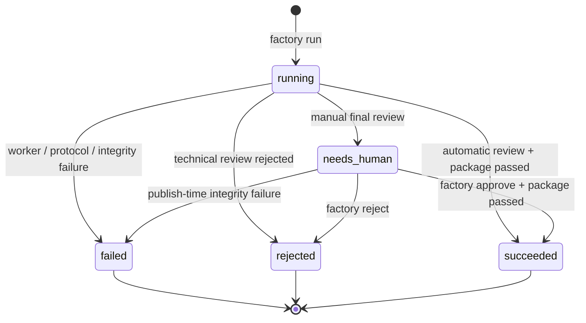
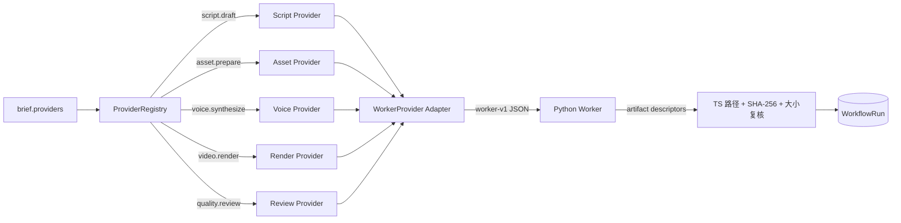

# VideoFactory 生产工作流与使用指南

本文描述当前 `ProductionPipeline` 的执行边界：从一个已确定的 `ProductionBrief` 开始，到生成经技术审片、视觉审片和人工终审的发布包结束。平台上传与真实指标回流仍由产品边界之外的人工或正式连接器负责。

## 1. 端到端生产流程



关键设计：

- `WorkflowRunner` 只负责状态机与节点调度；每种具体能力由 Provider 实现。
- 新 run 的创作规划必须经过导演初案、脚本、分镜三个持久化确认点。普通讨论可以解释、提出备选或修改当前稿，但自然语言中的“同意”不会越权确认；确认时独立复核当前可见版本，通过后才启动下一角色。刷新、离开和服务重启继续观察同一命令，不重复提交模型任务。
- `assets` 在 `script` 之后执行；素材报价获批并完成后才执行 `voice`，避免尚未接受画面方案时提前产生配音调用，二者完成后进入渲染。
- 图片和视频逐次报价并人工确认；TTS 自动执行、后台记账。FFmpeg 等本地计算失败只进入技术重试，不进入付费账单核对。
- 付费前沿用编剧和导演的独立审计：核对钩子与承诺兑现、镜头可执行性、画幅/时长、文字风险与跨镜一致性的具体实现依据。不增加额外的全方案模型审计轮次。
- Studio 的素材执行器在同一方案中，按 Provider、模型、图片/视频、画幅、是否依赖参考图区分生成路线。独立镜头优先选择 temporalBeats 更多、其次 successCriteria 更多的代表镜头作为试片，同分按镜号排序；参考图子镜仍在母片之后执行。这是基于现有字段的确定性选择，不保证覆盖所有内容风险。试片通过后才继续提交后续付费任务，试片直接进入正式素材，不另生成一份。
- 试片只审所选镜头的真实证据，不把其余未生成镜头当作缺帧。审片服务失败保留付费素材与角色检查点；质量不通过保留报告并按镜号进入原有返工建议预填。恢复不会重买相同镜头，后续尚未执行的付费任务仍遵守报价授权。
- 试片结果绑定方案输入指纹、实际文件 SHA-256、生成规格与审片模型；这些内容变化后重新审查。整批素材预检继续检查逐镜内容与跨镜一致性，最终审片继续检查成片效果。关键帧不能证明声音质量或连续运动流畅性，最终人工完整观看仍有必要。
- 源素材按脚本实际使用时长抽帧，不把未进入剪辑的尾段作为返工证据。纯 info 提示保留在原报告，不自动转成必改镜头；warning/critical 和不通过的审片结论仍阻断下游。仅因证据不足时应先复核已有素材，不直接要求重买。
- 最终成片审片由 GLM 与 Codex 对同一帧证据快照独立执行，确定性合并两份报告。发布前必须证明两个分支使用不同的实际 Provider/模型、同一 evidence digest，且两边 producer/audit trace 完整；任一条件不满足都阻止发布，不允许退化为单模型审片。
- TypeScript 是 `run.json` 的唯一所有者；Python worker 只写自己的 `attempt-1` 目录。
- 人工终审是一个持久化 intervention，可以批准、拒绝，或根据当前视觉审片 finding 提交受版本保护的局部素材返修。局部返修只按 finding 的主责任节点和受影响下游扩散，不无条件重做全片。
- `approve` 的加载、恢复、发布包写入和 revision 更新位于同一个 run lock transaction 中。
- 被打回后可从返工草稿重新制作。原模型、画面来源、声音和导演配置默认继承，视觉 finding 会按问题类型预填到编剧、视觉导演和素材执行输入；所有字段在开工前仍可修改。历史模板快照保持只读，不参与新返工。
- 每个模型节点只有一个首选模型；同一能力下其他健康模型是有序候选。系统只在调用层故障时切换，内容结构、业务校验或质量审计失败仍留在当前节点修正。模型尝试顺序和最终采用模型进入执行回执。
- 发布包只代表“可以发布”。Web 端已经提供多平台合规检查、明确确认、幂等批次和失败隔离；只有正式平台适配器与账号授权都就绪时才调用官方上传接口。

## 2. Run 状态流转



每次 run 的目录结构如下：

```text
workspace/factory/runs/<run-id>/
├── run.json
├── nodes/
│   ├── script/attempt-1/script.json
│   ├── assets/attempt-1/asset_plan.json
│   ├── voice/attempt-1/voiceover_plan.json
│   ├── render/attempt-1/renders/1/final.mp4
│   └── technical-review/attempt-1/technical_review.json
└── publish/publish_package.json  # 仅批准并通过完整性校验后生成
```

## 3. 已实现能力

| 能力 | 当前实现 | 自动/人工 | 可替换性 |
|---|---|---|---|
| Brief 合同 | `video-factory/brief-v1`，校验必填字段、20-180 秒、终审模式与 Provider binding | 自动 | 可新增协议版本 |
| 工作流调度 | TS DAG、依赖排序、节点状态、失败/拒绝传播 | 自动 | Node/Provider 接口可扩展 |
| 脚本 | Codex/GLM 有序候选池 + 独立审计；新制作不接受模板指导 | 自动 | 用户选择首选模型，兼容候选只在调用故障时接管 |
| 素材 | AI 导演逐镜路由 Pexels、Pixabay、Seedream、视频模型、人工素材和 `REUSE_ONLY` | 自动 + 付费前人工审批 | 图片/视频 Provider 通过目录与 adapter 扩展；失败不得生成说明卡 |
| 配音 | `minimax-tts-v1`、`macos-say-v1`；`ffmpeg-tone-test-v1` 仅用于测试 | 自动 | 可继续增加云 TTS 或真人录音 Provider |
| 渲染 | Python + FFmpeg，H.264/AAC，1080x1920 | 自动 | 可增加 Remotion 或其他渲染 Provider |
| 技术审片 | 分辨率、编码、音量、时长、分镜覆盖、素材存在性 | 自动 | 可增加视觉/内容质量模型 |
| 最终审片 | GLM/Codex 同证据独立双审；`manual` 支持跨进程 approve/reject；视觉 finding 可触发 `request_changes` 局部返修；`automatic` 可跳过无问题的人工节点 | 可配置 | 双审不可降级为单审；局部返修只允许复用同一 run 中更早且已物化的非说明卡母片 |
| 持久化 | 首个 worker 前创建 `run.json`，每个节点后 checkpoint | 自动 | 当前是单机 FileRunStore |
| 并发保护 | PID lock、孤儿锁回收、revision 与副作用事务 | 自动 | 尚不是分布式锁 |
| Worker 协议 | `video-factory/worker-v1` 单 JSON stdout，stderr 诊断 | 自动 | 可接入其他语言 worker |
| Artifact 治理 | attempt 目录隔离、SHA-256/大小复算、精确 lineage、Provider provenance | 自动 | 所有新节点应沿用同一合同 |
| 进程治理 | timeout/输出限制，终止 worker 及 FFmpeg/`say` 后代 | 自动 | 可替换为容器或队列 worker |
| 发布准备 | 生成人工决定、AIGC 显式/隐式标识与 artifact 清单完整的发布包 | 自动 | 多平台编排已实现；正式平台 adapter 需在官方应用获批后启用 |

## 4. Provider 扩展点



扩展一个节点时，需要明确四件事：

1. `Capability`：节点提供什么稳定能力，而不是绑定某个厂商名称。
2. Provider：具体实现、参数、版本和授权说明。
3. Artifact contract：输出类型、schema、hash、大小、父 artifact 与 producer。
4. Intervention：默认自动执行，真正需要人判断时才返回 `needs_human`。

## 5. 快速使用

### 5.1 环境检查

以下命令均在仓库根目录执行。当前免费默认链路面向 macOS，需要 Node.js、Python 3、FFmpeg、ffprobe 和系统 `say`：

```bash
npm install

command -v node
command -v python3
command -v ffmpeg
command -v ffprobe
command -v say
```

运行全部快速测试和真实媒体测试：

```bash
make test
make test-e2e
```

### 5.2 生成不需要 API key 的本地样片

```bash
RUN_JSON="$(npm --silent run factory -- run \
  examples/briefs/life-avoidance-local.json \
  --workspace workspace/factory)"

RUN_ID="$(printf '%s' "$RUN_JSON" | jq -r '.id')"
printf 'run id: %s\n' "$RUN_ID"
```

默认 brief 使用 `reviewMode: "manual"`，命令会在终审节点返回 `needs_human`。

查看完整 run：

```bash
npm --silent run factory -- show "$RUN_ID" \
  --workspace workspace/factory
```

取得并打开最终视频：

```bash
VIDEO_PATH="$(npm --silent run factory -- show "$RUN_ID" \
  --workspace workspace/factory \
  | jq -r '.artifacts[] | select(.kind == "render") | .uri')"

open "$VIDEO_PATH"
```

### 5.3 人工批准或拒绝

完整观看画面、字幕和旁白，并确认事实与素材授权后批准：

```bash
npm --silent run factory -- approve "$RUN_ID" \
  --actor "jinkun" \
  --note "画面、字幕、旁白、事实和授权检查通过" \
  --workspace workspace/factory
```

批准成功后检查发布包：

```bash
jq . "workspace/factory/runs/$RUN_ID/publish/publish_package.json"
```

需要返工时拒绝：

```bash
npm --silent run factory -- reject "$RUN_ID" \
  --actor "jinkun" \
  --note "素材与旁白节奏不匹配" \
  --workspace workspace/factory
```

`reject` 仍是终态。若视觉审片已经定位到具体镜头，可在 Studio 终审界面使用“提交局部返修”：选择更早且已物化的母片后，系统在同一 run 创建新的素材版本，只重跑渲染、技术质检、视觉审片和人工终审。改脚本或 Provider 等更大范围调整仍走节点编辑或重新规划。

### 5.4 使用 Pexels 或 Pixabay

先轮换曾经在聊天中明文出现过的 key，再将新 key 放入不会提交的 `.env.local`。程序不会主动读取该文件，因此运行前需要加载进程环境：

```bash
set -a
source .env.local
set +a
```

基于本地示例生成 Pexels brief，只替换素材 Provider：

```bash
mkdir -p workspace/briefs
jq '.providers.assets = "pexels-stock-v1"' \
  examples/briefs/life-avoidance-local.json \
  > workspace/briefs/life-avoidance-pexels.json

npm --silent run factory -- run \
  workspace/briefs/life-avoidance-pexels.json \
  --workspace workspace/factory
```

Pixabay 的替换方式相同：

```bash
jq '.providers.assets = "pixabay-stock-v1"' \
  examples/briefs/life-avoidance-local.json \
  > workspace/briefs/life-avoidance-pixabay.json
```

其余 `factory run/show/approve/reject` 命令保持不变。Provider 只替换素材节点，不会复制另一套核心 workflow。

## 6. 当前能力边界

| 状态 | 能力 | 说明 |
|---|---|---|
| 已实现 | Brief 到真实 MP4、技术/视觉审片、人工终审、局部素材返修和发布包 | 同一 run 保留版本、lineage 与审计证据 |
| 已实现 | 图片/视频逐镜报价与人工授权 | 没有全局或单视频硬费用上限；拒绝后由用户主动重新规划 |
| 已实现 | TTS 自动执行与人民币记账 | 不弹素材报价，但仍写入 operation ledger |
| 已实现 | 成片打回后的节点级返工草稿 | 继承原制作配置；审片意见真正进入脚本、导演和素材输入 |
| 已实现 | 严格选题准入与制作方向 | 候选必须同时满足价值、来源、可拍性与视频形态要求；模板暂不参与新制作 |
| 已实现 | 三阶段创作讨论与确认 | 导演初案、脚本、分镜分别可多轮讨论；用户确认当前版本后才进入下一阶段，最终确认后才报价 |
| 已实现 | 热点原文有界阅读与交接 | 正文段落、URL 与内容摘要进入总编及后续角色；读取失败和截断状态如实保留，不以标题冒充正文 |
| 已实现 | `REUSE_ONLY` 直接/间接母片复用 | 只允许更早且已物化的非说明卡媒体，费用为 0 |
| 单机边界 | File/JSON store、PID/文件锁、revision/CAS 与 execution lease | 多实例前必须换成带事务和唯一约束的数据库/协调层 |
| 人工边界 | 外部平台上传与真实指标回流 | 发布包不等于自动发布；当前不替用户操作平台账号 |
| 需逐片验证 | 新批准的付费最终成片 | 对具体成片执行 ffprobe、blackdetect、逐镜视觉和内部术语检查 |
