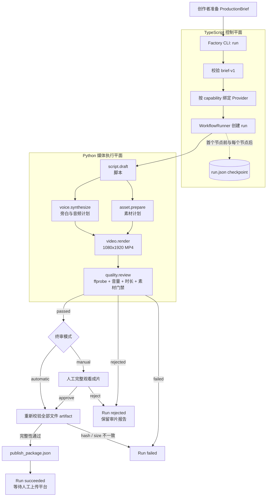
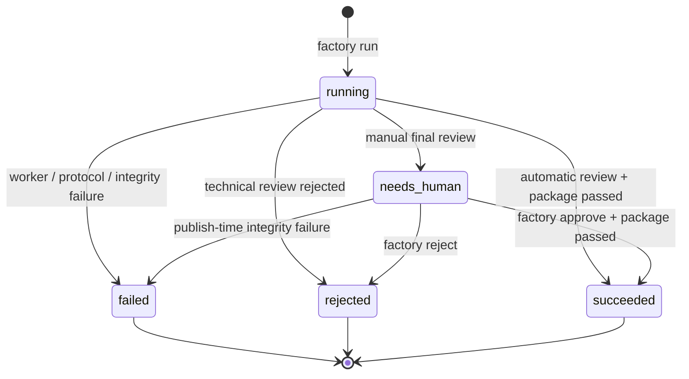
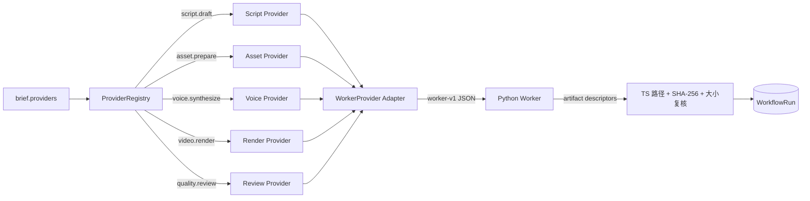

# VideoFactory 生产工作流与使用指南

本文描述 Loop 9 已经实现并通过真实媒体 E2E 验证的能力。它的边界是：从一个已确定的 `ProductionBrief` 开始，到生成经技术审片和人工终审的发布包结束。平台上传与真实指标回流尚未自动化。

## 1. 端到端生产流程



关键设计：

- `WorkflowRunner` 只负责状态机与节点调度；每种具体能力由 Provider 实现。
- `assets` 与 `voice` 在 `script` 之后并行，二者完成后才进入渲染。
- TypeScript 是 `run.json` 的唯一所有者；Python worker 只写自己的 `attempt-1` 目录。
- 人工终审是一个持久化 intervention，可以在另一个 CLI 进程中批准或拒绝。
- `approve` 的加载、恢复、发布包写入和 revision 更新位于同一个 run lock transaction 中。
- 发布包只代表“可以发布”。Web 端已经提供多平台合规检查、明确确认、幂等批次和失败隔离；只有正式平台适配器与账号授权都就绪时才调用官方上传接口。

## 2. Run 状态流转



每次 run 的目录结构如下：

```text
workspace/factory/runs/<run-id>/
├── run.json
├── nodes/
│   ├── script/attempt-1/script.json
│   ├── assets/attempt-1/asset_plan.json
│   ├── voice/attempt-1/voiceover_plan.json
│   ├── render/attempt-1/renders/1/final.mp4
│   └── technical-review/attempt-1/technical_review.json
└── publish/publish_package.json  # 仅批准并通过完整性校验后生成
```

## 3. 已实现能力

| 能力 | 当前实现 | 自动/人工 | 可替换性 |
|---|---|---|---|
| Brief 合同 | `video-factory/brief-v1`，校验必填字段、20-180 秒、终审模式与 Provider binding | 自动 | 可新增协议版本 |
| 工作流调度 | TS DAG、依赖排序、节点状态、失败/拒绝传播 | 自动 | Node/Provider 接口可扩展 |
| 脚本 | `python-template-v1` | 自动 | 可增加 LLM、规则模板或人工脚本 Provider |
| 素材 | `local-editorial-v1`、`pexels-stock-v1`、`pixabay-stock-v1` | 自动 | brief 中替换 Provider，无需改 graph |
| 配音 | `macos-say-v1`；`ffmpeg-tone-test-v1` 仅用于测试 | 自动 | 可增加商业 TTS 或真人录音 Provider |
| 渲染 | Python + FFmpeg，H.264/AAC，1080x1920 | 自动 | 可增加 Remotion 或其他渲染 Provider |
| 技术审片 | 分辨率、编码、音量、时长、分镜覆盖、素材存在性 | 自动 | 可增加视觉/内容质量模型 |
| 最终审片 | `manual` 支持跨进程 approve/reject；`automatic` 可跳过人工节点 | 可配置 | 当前人工动作严格限制为 approve/reject |
| 持久化 | 首个 worker 前创建 `run.json`，每个节点后 checkpoint | 自动 | 当前是单机 FileRunStore |
| 并发保护 | PID lock、孤儿锁回收、revision 与副作用事务 | 自动 | 尚不是分布式锁 |
| Worker 协议 | `video-factory/worker-v1` 单 JSON stdout，stderr 诊断 | 自动 | 可接入其他语言 worker |
| Artifact 治理 | attempt 目录隔离、SHA-256/大小复算、精确 lineage、Provider provenance | 自动 | 所有新节点应沿用同一合同 |
| 进程治理 | timeout/输出限制，终止 worker 及 FFmpeg/`say` 后代 | 自动 | 可替换为容器或队列 worker |
| 发布准备 | 生成人工决定、AIGC 显式/隐式标识与 artifact 清单完整的发布包 | 自动 | 多平台编排已实现；正式平台 adapter 需在官方应用获批后启用 |

## 4. Provider 扩展点



扩展一个节点时，需要明确四件事：

1. `Capability`：节点提供什么稳定能力，而不是绑定某个厂商名称。
2. Provider：具体实现、参数、版本和授权说明。
3. Artifact contract：输出类型、schema、hash、大小、父 artifact 与 producer。
4. Intervention：默认自动执行，真正需要人判断时才返回 `needs_human`。

## 5. 快速使用

### 5.1 环境检查

以下命令均在仓库根目录执行。当前免费默认链路面向 macOS，需要 Node.js、Python 3、FFmpeg、ffprobe 和系统 `say`：

```bash
npm install

command -v node
command -v python3
command -v ffmpeg
command -v ffprobe
command -v say
```

运行全部快速测试和真实媒体测试：

```bash
make test
make test-e2e
```

### 5.2 生成不需要 API key 的本地样片

```bash
RUN_JSON="$(npm --silent run factory -- run \
  examples/briefs/life-avoidance-local.json \
  --workspace workspace/factory)"

RUN_ID="$(printf '%s' "$RUN_JSON" | jq -r '.id')"
printf 'run id: %s\n' "$RUN_ID"
```

默认 brief 使用 `reviewMode: "manual"`，命令会在终审节点返回 `needs_human`。

查看完整 run：

```bash
npm --silent run factory -- show "$RUN_ID" \
  --workspace workspace/factory
```

取得并打开最终视频：

```bash
VIDEO_PATH="$(npm --silent run factory -- show "$RUN_ID" \
  --workspace workspace/factory \
  | jq -r '.artifacts[] | select(.kind == "render") | .uri')"

open "$VIDEO_PATH"
```

### 5.3 人工批准或拒绝

完整观看画面、字幕和旁白，并确认事实与素材授权后批准：

```bash
npm --silent run factory -- approve "$RUN_ID" \
  --actor "jinkun" \
  --note "画面、字幕、旁白、事实和授权检查通过" \
  --workspace workspace/factory
```

批准成功后检查发布包：

```bash
jq . "workspace/factory/runs/$RUN_ID/publish/publish_package.json"
```

需要返工时拒绝：

```bash
npm --silent run factory -- reject "$RUN_ID" \
  --actor "jinkun" \
  --note "素材与旁白节奏不匹配" \
  --workspace workspace/factory
```

`reject` 是终态。当前版本还没有从拒绝节点直接编辑并重试的状态迁移，应修改 brief 或 Provider 后创建新 run。

### 5.4 使用 Pexels 或 Pixabay

先轮换曾经在聊天中明文出现过的 key，再将新 key 放入不会提交的 `.env.local`。程序不会主动读取该文件，因此运行前需要加载进程环境：

```bash
set -a
source .env.local
set +a
```

基于本地示例生成 Pexels brief，只替换素材 Provider：

```bash
mkdir -p workspace/briefs
jq '.providers.assets = "pexels-stock-v1"' \
  examples/briefs/life-avoidance-local.json \
  > workspace/briefs/life-avoidance-pexels.json

npm --silent run factory -- run \
  workspace/briefs/life-avoidance-pexels.json \
  --workspace workspace/factory
```

Pixabay 的替换方式相同：

```bash
jq '.providers.assets = "pixabay-stock-v1"' \
  examples/briefs/life-avoidance-local.json \
  > workspace/briefs/life-avoidance-pixabay.json
```

其余 `factory run/show/approve/reject` 命令保持不变。Provider 只替换素材节点，不会复制另一套核心 workflow。

## 6. 当前能力边界

| 状态 | 能力 | 说明 |
|---|---|---|
| 已完成 | Brief 到真实 MP4、技术审片、人工终审、发布包 | Loop 9 已通过真实媒体 E2E |
| 已完成但独立 | 选题候选生成、评分、周计划和指标记录 CLI | 尚未接入 `daily-production` graph |
| 下一阶段 | 选题 Agent -> brief 自动生成 | 需要真实账号数据校准选题目标与评分权重 |
| 下一阶段 | 正式 Agent tool surface | 至少暴露 `start_production_run` 与 `get_production_run`，终审仍由人完成 |
| 下一阶段 | 抖音等平台自动上传 | 需要平台权限、风控策略、AIGC 标识和失败补偿 |
| 下一阶段 | 发布后 T+24h 指标回流 | 先用 3 条真实发布验证字段与节奏，再自动化 |
| 未实现 | 分布式队列、跨主机锁、自动 retry/resume | 当前单机每天一条的目标不要求这些设施 |
| 待验证 | 高品质 TTS、外部素材对播放表现的增益 | 先用真实数据判断，不提前增加持续成本 |

## 7. Loop 10 的正确入口

Loop 10 不是继续堆功能，而是完成一次最小市场闭环：

1. 固定一个账号、一个内容方向和一套视觉模板。
2. 连续生产并人工终审 3 条视频。
3. 人工上传并记录 `run id`、平台 `post id/URL` 与发布时间。
4. T+24h 回填播放、完播、互动和新增关注。
5. 用数据决定先改选题、脚本、素材、配音还是节奏；一次只改变一个主要变量。
