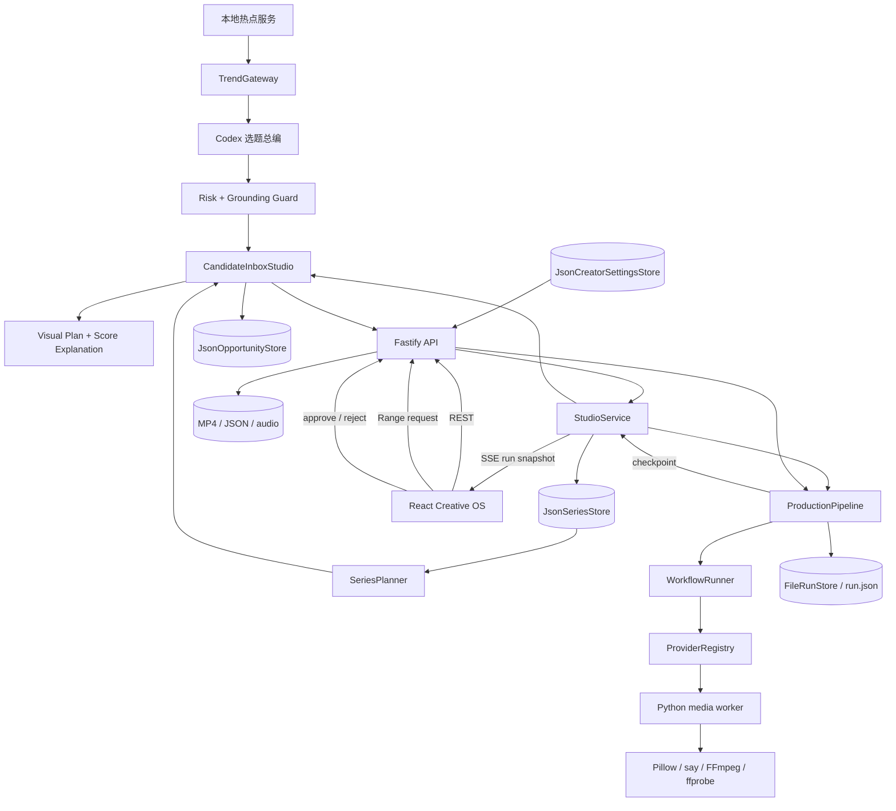

# VideoFactory Creative OS

Creative OS 是本地短视频流水线的正式 Web 工作台。它把中文热点聚合、Codex 选题提案、持久系列、自定义选题、证据核验、可执行视觉计划、可替换 Provider、生产运行、视频审片和制作复盘放进同一个系统；React 页面不复制 workflow 逻辑，Fastify 不生成演示热点或平台指标。

## 启动

开发模式：

```bash
cd /Users/jinkun.wang/work_space/veidofactory
npm install
make setup-local-trends
npm run studio:dev
```

打开 `http://127.0.0.1:4317`。Vite 在 4317，Fastify API 在 4318。

生产模式必须先构建、后启动：

```bash
npm run studio:build
npm run studio:start
```

Fastify 在 `http://127.0.0.1:4317` 同时提供页面和 API。若构建发生变化，应重启生产服务，使静态资源清单与新哈希文件一致。

外部 Provider 通过进程环境启用；Studio 只显示“可用/缺少条件”，不读取或返回 key 值：

```bash
set -a
source .env.local
set +a
npm run studio:dev
```

## 完整流程

```mermaid
flowchart LR
    A[TrendRadar / NewsNow / DailyHot / RSSHub] --> B[TrendGateway 去重与证据标准化]
    B --> C[宿主机 Codex 选题总编]
    C --> D[分类 / 风险 / 事实收敛]
    D --> E[热点候选]
    V[(series.json)] --> W[SeriesPlanner 下一集]
    X[自定义观察 / JSON] --> F{统一候选收件箱}
    E --> F
    W --> F
    F --> G{可信度闸门}
    G -->|常规风险且来源达标| H[三拍视觉计划 + 分数解释]
    G -->|中风险| I{人工确认}
    G -->|高风险且不足两条独立来源| J[阻止采用并补充来源]
    I -->|确认继续| H
    H -->|跳过| F
    H -->|采用到制作区| K[(opportunities.json)]
    K --> L[可编辑 Production Brief]
    Y[(settings.json)] --> L
    L --> M[Provider 就绪与预算检查]
    M --> N[ProductionPipeline]
    N --> O[脚本]
    O --> P[画面]
    P --> Q[角色配音与后期]
    Q --> R[渲染]
    R --> S[机器质检]
    S -->|通过| T{人工终审}
    S -->|不通过| U[Rejected + 报告]
    T -->|打回并写原因| U
    T -->|批准| Z[发布包]
    Z --> AA[人工发布]
    AA --> AB[平台真实结果连接器]
    AB --> AC[制作复盘]
```



当前已经实现本地热点服务、DailyHotApi/NewsNow 信号聚合、Codex 选题提案、热点分类分面、可信度闸门、持久系列、AI 导演与逐镜素材路由、创作默认值、人工终审、多平台发布编排和基于 persisted runs 的制作统计。TrendRadar 与 RSSHub 当前只接入健康检查；当前个人主体的抖音与小红书只生成发布包，头条、快手和 B 站正式适配器需在官方应用与账号权限获批后启用。模型不可用时页面会显示确定性降级来源，不冒充模型结果。

## 使用方法

### 0. 第一次进入先跟随创作向导

首次打开工作台会自动出现完整的 15 步创作向导，并在关键步骤实际跳转到对应页面。右下角常驻“创作向导”按钮，可随时重新打开完整向导或只看当前页面；每一步都可以后退，也可以提前结束。向导不会替用户采用候选、启动制作或批准成片。

### 1. 启动本地情报底座

`make setup-local-trends` 会以 Docker 运行四个只绑定本机的开源服务。语义模型统一来自宿主机 Codex bridge（`make codex-broker-status` 可探测），不部署任何自托管本地模型。资源页展示每个服务最近一次健康检查的 URL、状态和错误证据；Today 从 DailyHotApi 与 NewsNow 读取抖音、微博、知乎、B 站榜单，去重后交给 Codex 选题总编。

TrendRadar 自带 11 个中文平台榜单与静态报告，当前关闭其内置 AI 分析和翻译，避免未配置 key 的调用。TrendRadar MCP 保留在 `127.0.0.1:3333`，供后续 Agent Graph 接入。

### 2. 选择热点、系列或自定义创作

进入“今日机会”后有三个并列入口：

- 热点机会：阅读全部 Agent 提案，按内容分类、平台、时效和风险筛选，核验原始证据后采用。
- 系列选题：创建包含长期承诺、受众、内容支柱、语气和视觉方向的系列；系统持续生成带集数的下一集候选。
- 自定义创作：手动填写自己的观察，或导入其他研究/Agent 产生的严格 JSON。

热点候选在采用前会经过可信度闸门：

- 常规风险：来源达到最低要求后可直接采用。
- 需要复核：点击采用后必须在确认框中明确继续，系统不会悄悄放行。
- 高风险公共事件：至少需要 2 条带 URL 的独立来源；不足时采用按钮禁用。模型生成的扩展事实不会进入标题、hook 或推荐理由。

每张候选卡会解释总分的主要贡献项和风险扣分，并给出开场、展开、收束三拍视觉计划。素材来源只是建议，可在正式 Brief 中替换为本地素材、素材库、编辑卡片或已配置的生成式视觉 Provider。

三个入口采用后都会进入同一个制作机会区。任何正式机会必须包含：

- 标题、平台、系列 slug、受众、痛点和开场 hook。
- 至少一条证据：来源、平台、关键词和 0-100 信号强度；建议提供证据 URL 和采集时间。
- 七项人工评分：人群、视觉可行性、成本效率、新鲜度、商业潜力、系列潜力和合规风险。

JSON 示例：

```json
{
  "title": "每天一条 AI 视频，为什么不该全用文生视频",
  "platform": "douyin",
  "track": "ai-video-reality",
  "audience": "想低成本稳定更新的创作者",
  "painPoint": "完整 T2V 成本高、失败重试多",
  "hook": "真正能每天更新的人，往往只把 AI 视频模型用在最贵的五秒。",
  "evidence": [
    {
      "source": "Wan2.2",
      "platform": "github",
      "keyword": "TI2V-5B 竖屏生成与硬件成本",
      "strength": 84,
      "evidenceUrl": "https://github.com/Wan-Video/Wan2.2",
      "collectedAt": "2026-08-20T11:00:00.000Z"
    }
  ],
  "scores": {
    "audienceReach": 78,
    "visualFeasibility": 87,
    "productionCostEfficiency": 92,
    "novelty": 81,
    "monetization": 68,
    "seriesPotential": 86,
    "complianceRisk": 10
  }
}
```

API 会重新校验输入并由 workflow-core 计算最终分，不接受前端伪造的 `final`。持久化结果同时记录 `scoreProvenance.source` 和 `scoreProvenance.scoredAt`；当前人工录入路径会明确标记为“人工维度评分 · topic-intelligence-v1”。

### 3. 选择并新建制作

机会按最终分和新鲜度排序。选择后检查证据 URL、hook、受众、分数解释和三拍视觉计划；右侧决策面板会显示五项制作能力是否就绪。点击“新建制作”后，标题、hook、受众、系列、平台和已保存的经济型制作默认值会预填到正式 Brief，但仍可人工编辑，只有点击“开始制作”才会派发 run。

制作弹窗的 Voice Studio 会读取可用声音，支持试听、语速、标点停顿和 `natural/intimate/social` 三种声音质感。所选音色与配音能力会在客户端和服务端交叉校验。在“总配置”保存成本策略、导演角色、平台、时长、终审方式、声音和默认画面来源后，新制作会自动继承；创建时仍可针对单条视频修改。

### 4. 跟踪生产

“制作记录”从磁盘读取 run，可以按全部、制作中、等你审片、已结束筛选，也可以按标题搜索。制作详情页通过 SSE 接收 checkpoint；连接中断时页面会提示并由浏览器自动重连。列表页需要刷新后读取最新状态。

### 5. 审片并生成发布包

机器质检通过后，运行进入 `needs_human`：

1. 使用原生控件完整观看 9:16 成片。
2. 查看每个 workflow 节点和按节点分组的脚本、画面、配音、渲染、质检报告。
3. 批准会继续生成发布包；打回必须填写明确原因。
4. 决定和 revision 持久化到 `run.json`，重复/冲突决定返回 `409`。

### 6. 检查总配置与制作复盘

“总配置”集中设置新建制作默认值，并展示热点服务、声音、画面、岗位模型和发布渠道的真实状态；API Key 仍只存在服务端环境中，不会回传浏览器。“制作复盘”目前只统计 persisted run 的制作结果；平台播放、完播、互动和涨粉在连接数据前不会显示，也暂不支持 Web 手工录入。

## 系统架构



`JsonOpportunityStore`、`JsonSeriesStore` 与 `JsonCreatorSettingsStore` 使用写队列和同目录临时文件原子 rename。`CandidateInboxStudio` 负责热点/系列候选的统一分面、过滤、可信度闸门、采用和去重；`SeriesPlanner` 是可替换策划端口。`ProductionPipeline` 使用 revision/CAS、artifact 路径边界、大小与 SHA-256 校验。这些存储边界均可在后续替换为数据库实现，而不改变 UI API。

## 能力矩阵

| 能力 | 当前状态 | 真实边界 |
| --- | --- | --- |
| 中文热点底座 | 部分实现 | 4 套服务可自托管并独立报告健康；统一信号网关当前读取 DailyHotApi 与 NewsNow |
| Codex 选题总编 | 已实现 | 宿主机 Codex bridge；结构化输出；失败时明确标记 heuristic fallback |
| 候选收件箱 | 已实现 | 热点/系列统一查询；分类、平台、时效、风险分面；渐进加载；采用后去重 |
| 事实与风险闸门 | 已实现 | 中风险显式确认；高风险要求 2 条独立 URL 来源；敏感公共事件只使用来源可支撑的陈述 |
| 视觉导演计划 | 已实现 | 每个候选给出开场、展开、收束三拍；素材策略可在 Brief 中替换 |
| 系列与集数策划 | 已实现 | 系列原子持久化；内容支柱；连续集数候选；采用后推进下一集 |
| 机会录入与排序 | 已实现 | Agent 入池、手动或 JSON；证据必填；workflow-core 计算分数 |
| 机会状态 | 已实现 | `draft -> shortlisted/approved/rejected -> tested` 受状态机约束 |
| Production Brief | 已实现 | 从机会预填但必须人工确认 |
| 创作默认值 | 已实现 | 成本策略、导演、平台、时长、终审、声音与素材 Provider 持久化并自动继承 |
| 站内创作向导 | 已实现 | 首次自动出现；15 步跨页向导；当前页向导；悬浮入口；可提前结束 |
| 本地制作 | 已实现 | 脚本、编辑卡片、macOS 配音、FFmpeg mastering、ffprobe |
| 外部素材 | 可插拔 | Pexels/Pixabay 需要 key，未配置时禁用 |
| Codex 语义层 | 已实现 | 选题总编、编剧、视觉导演、发行编辑四角色；人工终审与确定性技术质检保留为硬边界 |
| 自动趋势采集 | 部分实现 | DailyHotApi/NewsNow 已归一化；TrendRadar/RSSHub 当前仅做健康检查 |
| AI 视频生成 | 可配置 | Seedance/MiniMax 海螺/Wan 已实现异步适配与预计成本门禁；默认关闭，需 key、模型 ID 和估价 |
| 审片与发布包 | 已实现 | 视频 Range 播放、技术报告、批准/打回、发布包 |
| 自动平台发布 | 未实现 | 当前保留人工登录与发布，避免平台风控和误发 |
| 平台指标回流 | 未实现 | Web 暂无连接器或手工录入；可先使用既有 CLI 或外部表格记录 |

## API

- `GET /api/health`
- `GET /api/providers`
- `GET /api/settings`
- `PATCH /api/settings`
- `GET /api/local-capabilities`
- `GET /api/voices`
- `POST /api/voices/preview`
- `GET /api/trend-services`
- `GET /api/trend-signals`
- `GET /api/trend-candidates`
- `GET /api/candidate-inbox`
- `POST /api/candidate-inbox/:candidateId/adopt`
- `GET /api/series`
- `POST /api/series`
- `GET /api/opportunities`
- `POST /api/opportunities`
- `GET /api/opportunities/:opportunityId`
- `PATCH /api/opportunities/:opportunityId/status`
- `GET /api/runs`
- `POST /api/runs`
- `GET /api/runs/:runId`
- `GET /api/runs/:runId/events`
- `POST /api/runs/:runId/decisions`
- `GET /api/runs/:runId/artifacts/:artifactId/content`

## 验证

```bash
npm test
npm run typecheck
npm run build
make test-e2e
```

浏览器验收视口为 390x844、768x1024、1280x720、1440x900、1920x1080。验收应覆盖 Today 空/有数据状态、机会切换、Brief 预填、四个主路由、制作筛选、真实 run、视频可播放、人工批准与无 document-level 横向溢出。
