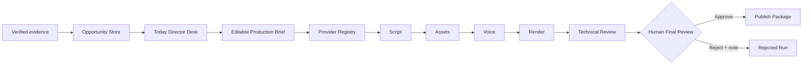

# Loop 11 Results: Creative OS

Date: 2026-08-23

## Objective

Replace the old two-route Web Studio with a production-grade Director Desk + Signal Room experience, backed by persisted opportunity evidence and the existing real video pipeline. Runtime data must be real or explicitly unconfigured.

## Delivered

- Added strict opportunity DTO/input parsing, score bounds, evidence URL/time validation, and status contracts.
- Added `JsonOpportunityStore` with queued writes, duplicate protection, validated transitions, sibling temporary files, and atomic rename.
- Added list/create/get/status Studio service methods and REST routes under `/api/opportunities`.
- Replaced the old shell with Today, Projects, Resources, and Experiments destinations plus compatibility redirects.
- Added opportunity radar, evidence focus, director readiness, manual/JSON import, and editable Production Brief handoff.
- Added project status filters and title search.
- Redesigned run review around the native video monitor, compact workflow track, sticky human decision, and artifacts grouped by producer node.
- Added explicit unconfigured states for trend ingestion, reasoning/director models, generative visuals, and platform analytics.
- Replaced the prior UI styling with the approved Creative OS design system across desktop, tablet, and mobile.
- Updated `README.md`, `DESIGN.md`, and `docs/guides/web-studio.md` with current usage, architecture, flow, and capability boundaries.

## Implemented Flow

## Verification Evidence

### Automated

- `npm test`: exit 0.
  - TypeScript/package suites: 35 passed, 1 explicitly skipped because the real E2E flag was absent.
  - Studio client: 19 passed.
  - Studio contracts/store/API/service: 22 passed.
  - Built package entrypoints: 3 passed.
  - Production Vite/server build completed.
- `PYTHONPATH=src python3 -m unittest discover -s tests`: 29 passed.
- `make test-e2e`: real `say` + FFmpeg + ffprobe 1080x1920 audible production and approval passed.

### Browser

Checked 390x844, 768x1024, 1440x900, and 1920x1080 against a separate QA workspace.

- No document-level horizontal overflow at any required viewport.
- Mobile navigation and primary controls meet a 44px touch target; muted canvas copy uses the reviewed higher-contrast token.
- Opportunity selection updates evidence, scores, hook, and director data.
- Opportunity score source/time and candidate freshness are visible in the decision workspace.
- Projects keeps its next action visible at 390px and 768px; Provider status is visible without horizontal scrolling.
- Production dialog opens with title, hook, audience, track, and platform prefilled.
- Missing Pexels/Pixabay credentials appear as disabled providers without exposing values.
- All four routes open at scroll position 0.
- A real local run reached `needs_human` in approximately five seconds with eight pre-approval artifacts.
- The generated MP4 reached browser `readyState=4`; the review page displayed six artifact groups.
- Browser approval advanced the run to `succeeded` and created the ninth artifact, `publish_package`.

## Defects Found And Fixed During Browser Loop

1. Mobile “录入机会” wrapped to two lines at 390px. Buttons now preserve command text on one line.
2. Client-side route navigation retained the prior page scroll position. AppShell now resets scroll on path change.
3. The 768px director controls used a four-column layout whose primary action was clipped by the workspace. The tablet layout now uses a 2x2 grid.
4. Rebuilding while a production server was running left Fastify's registered static-resource paths stale. Documentation now requires build before start/restart.
5. Successful dialog submissions left hidden components in a permanent submitting state. Both creation dialogs now reset after every submission, with reopen regression coverage.
6. Independent review found partial-request failures masquerading as empty data, an SSE snapshot race, test Providers satisfying formal readiness, missing score provenance, and modal focus leaks. These now have explicit states or regression tests.
7. Projects kept its next action beyond a wide mobile table, and the tablet Director Desk hid the resource link. Narrow layouts now keep both actions visible without horizontal page overflow.

## Honest Remaining Boundaries

- Trend collection is an API/provider extension point; no automated Douyin trend connector is configured.
- No LLM/director model or image/video generation model is configured in the default registry.
- Default visuals remain the deterministic local editorial quality baseline; Pexels/Pixabay require their keys and manual license review.
- Publishing remains manual. Platform metrics remain absent until an authorized connector, export import, or manual entry path exists.
- The opportunity store is appropriate for the current single-machine/single-operator scale; multi-process deployment should replace it with a transactional database implementation.
