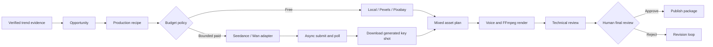

# Loop 12: Economic Provider Routing

Date: 2026-08-23

## Objective

Turn the production form into an economic, extensible resource router. The default path must remain free and locally reproducible, while configured video-generation APIs can be used for a bounded number of high-value shots. Trend sources must expose honest connector readiness instead of fabricated signals.

## Success Criteria

- The default recipe dispatches no metered provider and has a `¥0` budget.
- Paid generation requires an explicit recipe, positive shot cap, positive CNY cap, complete credentials, and a configured conservative per-clip estimate.
- Seedance and Wan implement real asynchronous submit, poll, failure, timeout, and result download behavior.
- The Web Studio exposes provider modes, billing, readiness, requirements, fallback routes, and trend-source states.
- Pexels, Pixabay, local visuals, Seedance, Wan, planned providers, and trend sources are visible without hiding them in fixed selects.
- Tests, type checks, production build, and desktop/mobile browser checks pass.

## Implemented Flow



## Economic Recipes

| Recipe | Default route | Paid shots | Default cap |
| --- | --- | ---: | ---: |
| Economy daily | local editorial | 0 | ¥0 |
| Free stock | Pexels/Pixabay with local fallback | 0 | ¥0 |
| AI key shot | one configured video model with local fallback | 1 | operator-defined |
| Cinematic AI | configured video model with local fallback | bounded | operator-defined |

Provider estimates are configuration inputs used for a preflight guardrail. They are not live pricing and must be updated when the account's billing changes.

## Provider State Model

- `ready`: complete runtime and credential configuration; selectable.
- `needs_config`: adapter exists, but one or more required fields are missing.
- `planned`: visible roadmap provider with no callable adapter; never selectable.
- `free`: local or external free-tier source; API terms and quotas may still apply.
- `metered`: external call is blocked unless the brief explicitly enables it and both budget bounds pass.

## Trend Source Model

- Manual research and strict JSON import are available now.
- Douyin official hotsearch is exposed as `needs_config` until the application has the approved scope and a client token.
- NewRank and Ocean Engine are represented as authorized manual/commercial imports until a real API contract exists.
- No source status creates trend records by itself; evidence must be imported or collected by an authorized connector.

## Configuration

```bash
cp .env.example .env.local
set -a; source .env.local; set +a
npm run studio:dev
```

Seedance:

- `ARK_API_KEY`
- `SEEDANCE_MODEL_ID`
- `SEEDANCE_ESTIMATED_CNY_PER_CLIP`
- optional `SEEDANCE_BASE_URL`

Wan:

- `DASHSCOPE_API_KEY`
- `DASHSCOPE_WORKSPACE_ID`
- `WAN_MODEL_ID`
- `WAN_ESTIMATED_CNY_PER_CLIP`
- optional `WAN_BASE_URL`

Douyin hotsearch status:

- `DOUYIN_HOTSEARCH_ENABLED=1`
- `DOUYIN_CLIENT_TOKEN`
- approved application scope remains an external prerequisite

## Audit Artifacts

When a paid model is used, the asset node writes:

- `asset_plan.json` with mixed local/generated scene provenance.
- `generation_jobs.json` with provider, task ID, lifecycle, estimate, and result URL.
- downloaded MP4 files under the node attempt directory.
- SHA-256, size, content type, producer node, attempt, provider, and review note for each artifact.

## Known Boundary

Kling, Hailuo, and Vidu are catalog entries only until their official account/API contracts are configured and their adapters receive the same lifecycle, budget, and artifact tests. Automatic Douyin trend collection is not claimed until the approved scope can be exercised against the real API.
