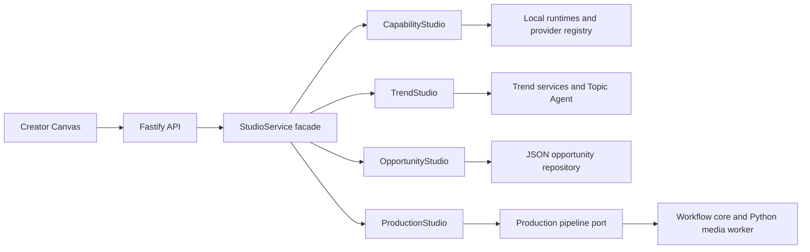

# Loop 16: Creator Canvas, Architecture And Full Browser QA

## Outcome

Studio 完成了一轮真实浏览器 dogfood、架构拆分和 Creator Canvas 视觉重构。本节数字均为 2026-08-24 当次开发机证据，不代表新环境的固定能力：两条制作分别走通批准与打回，当时发现的 29 种本地音色逐项试听，核心路由在桌面与手机尺寸做了像素和控制台检查。

## Defects Found And Fixed

- Kokoro 神经音色首次试听会超过通用 60 秒命令时限。语音合成改用 180 秒专用预算，普通命令仍保持 60 秒；本次开发机当时预热了 10 个 Kokoro 音色。
- 机会评分曾直接显示长浮点数，现统一显示为可读整数百分比。
- 旧视觉层的横向导航规则泄漏到新侧栏，导致桌面导航被挤压；Creator Canvas 现在显式拥有自己的稳定导航布局。
- 移动端主动作隐藏文字后仍占据 flex 宽度，导致加号离开可视区域；现以 `font-size: 0` 保留纯图标命令。
- 最终部署按 build 后 restart 的顺序完成，并验证哈希脚本 MIME 为 `application/javascript`。

## Browser Click Matrix

| Surface | Controls exercised | Result |
| --- | --- | --- |
| Today | 顶部/侧栏录入、两条机会切换、关闭与取消 | Passed |
| Opportunity entry | manual/JSON 模式、基础与高级输入、验证、保存/取消路径 | Passed by browser and component tests |
| Production dialog | 四种配方、五个可替换节点、Provider 选择、高级开关、自动/人工终审、开始/取消 | Passed |
| Projects | 全部/生产中/等待审片/已结束、搜索/清空、新建生产、任务入口 | Passed |
| Voice studio | 推荐/神经女声/神经男声/系统四个分组，10 个 Kokoro 与 19 个 macOS 音色，语速、停顿和三档质感 | Passed; all preview responses decoded |
| Resources | 能力刷新、四项本地热点状态、热点列表、模型与 Provider 台账 | Passed |
| Run review | 成片下载、批准、打回弹窗、必填原因、取消与确认 | Passed on real runs |
| Navigation | 今日、项目、资源、复盘四个桌面和移动入口 | Passed |

## Real Workflow Proof

- Approved reference run: `run-ee4ad324-0d31-4557-a71f-3ef3826e343f`.
- Rejected browser run: `run-64596459-2dd9-4c1d-96f8-17ba11bd34ca`; rejection note and `REV 1` persisted.
- Both paths used the real TypeScript workflow, Python media worker, FFmpeg render, technical review and human decision state.
- `make test-e2e` produced and approved another audible 1080x1920 package in 17.9 seconds.

## Architecture Result

The former 564-line service was replaced by a 118-line stable facade and four cohesive modules:

- `CapabilityStudio`: runtime, providers, voices and previews.
- `TrendStudio`: source/service health, signals and topic Agent candidates.
- `OpportunityStudio`: scoring, persistence and lifecycle.
- `ProductionStudio`: dispatch, decisions, SSE listeners, run mapping and artifact safety.

The full decision and tradeoff are recorded in [ADR 003](../adr/003-studio-module-boundaries.md).

## Visual Direction

Three implementable directions were compared. Creator Canvas scored highest at 92/100, ahead of Editorial Desk at 84 and Cinematic Control Room at 80. The selected direction combines:

- [Runway](https://runwayml.com/product/ai-video-editor): media/model/workflow-centered creation.
- [Frame.io](https://frame.io/creative-management-platform): explicit review and approval state.
- [Descript](https://help.descript.com/hc/en-us/articles/37585546799757-The-editor-interface): clear editorial hierarchy.
- [CapCut](https://www.capcut.com/resource/pc-professional-video-editor): visible assets and efficient creator controls.

The implementation uses a light Creator Studio rail, editorial serif hierarchy, neutral paper surfaces, cobalt primary actions, coral creative emphasis, real cached Pexels frames, a media-first opportunity canvas, and a fixed four-item mobile navigation. It does not copy any reference product's branding.

## Verification

- `npm test`: passed; typecheck, 44 TypeScript tests, 28 frontend tests, 49 Studio/server tests, production build and 3 package tests. One real E2E case is intentionally skipped in this unit command.
- `make test-py`: 31 passed.
- `make test-e2e`: 1 passed; audible 1080x1920 production package approved.
- Browser route sweep: Today, Projects, Resources and completed Run at 1440x900 and 390x844; no horizontal overflow and zero browser warnings/errors.
- Static deployment probe: hashed JS returned `200` with `application/javascript`; `/api/health` returned `ok` with Python, FFmpeg, ffprobe and macOS `say` ready.
- `git diff --check`: passed.

## Honest Boundaries

- Seedance, Wan, Kling, Hailuo and Vidu are represented as replaceable model resources, but paid calls remain disabled until credentials, account entitlement and cost estimates are provided.
- Platform publishing and post-publication analytics are not connected; the UI deliberately shows no fabricated reach or growth data.
- 本次开发机当时启动了 TrendRadar、NewsNow、DailyHotApi 和 RSSHub；统一信号网关仅消费 DailyHotApi 与 NewsNow。官方抖音热点自动采集仍缺少已验证适配器；新榜和巨量算数仍是授权/人工边界。
