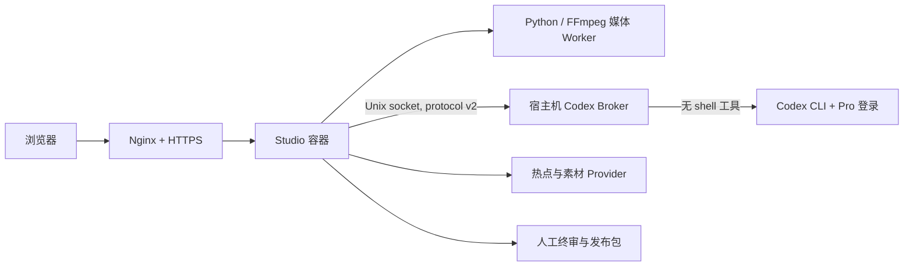

# Codex 云端生产迁移与部署计划

## 目标

在不向应用容器暴露 ChatGPT/Codex 登录凭据的前提下，把 VideoFactory 部署到阿里云 ECS，并让选题总编、编剧、视觉导演和发行编辑统一使用宿主机 Codex。移除活跃的 Ollama、千问和 DeepSeek 路径，保留确定性媒体流水线与真实能力门禁。

## 生产拓扑

## 实施步骤

1. 用数据专用协议 v2 固定四类任务，由 Broker 独占提示词、Schema 与执行参数。
2. 使用独立 `vf-codex` 用户、systemd 和组权限 Unix socket 隔离 Codex 凭据。
3. 容器只读挂载 socket 目录，不挂载 `~/.codex`，不保存模型 API key。
4. 部署脚本原子切换 Broker release 与应用镜像，任一健康检查失败则双回滚。
5. Web 只展示经过协议健康检查的 Codex 能力，并区分免费、订阅额度与按量计费。
6. 云端缺少正式 TTS 时阻止生产，测试音轨不得冒充成片配音。

## 验收

- `npm test`、`make test-py`、`make test-e2e` 全部通过。
- 真实 Broker v2 任务返回结构化 JSON，健康计数记录成功，临时任务目录被清理。
- ECS 上 systemd、Unix socket、容器健康检查和公网 HTTPS 均通过。
- 浏览器完成登录、引导、选题、项目、资源、制作配置和错误门禁的真实点击检查。
- Claude Code 与 Codex 独立复审后没有未处理的高、中严重度代码问题。

## 已知外部前置条件

Linux ECS 不提供 macOS `say`，正式出片需要后续接入一个云 TTS Provider 及其独立 API 额度。当前部署可以运行 Web、热点、Codex 语义角色、素材规划与管理流程，但会在开始正式制作前明确阻止缺少配音能力的请求。
