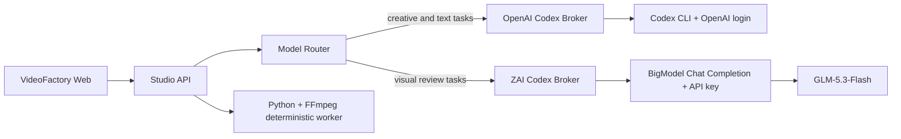

# Editable Node Workspaces And ZAI Codex Design

Date: 2026-08-27

## Goal

把 VideoFactory 从只能查看最终成片的自动流水线升级为云端人机协作制作台：每个生产节点都展示本次实际执行能力、模型、Provider、计费方式和产物；每个角色都能用符合其工作的方式预览并编辑产物；人工修改后，下游只消费修改后的生效版本。生产环境同时保留 OpenAI Codex，并在阿里云新增隔离的 ZAI BigModel 执行器，使用普通按量 API 的 GLM-5.3-Flash 承担视觉审片。Coding Plan 订阅不得用于自建网站后端。

## Research-Validated Product Direction

截至 2026-08-27，主流产品和开源项目共同指向同一套交互分层：

- Canva 和 CapCut 让用户先选有明确结构、时长和画面槽位的模板，再替换内容并继续编辑。
- Runway 同时提供低门槛标准流程与可复用节点 Workflows，复杂图不是所有用户的默认入口。
- ComfyUI 把完整 workflow 和可复用 subgraph 都做成带版本、预览和依赖信息的模板。
- LangGraph 的 checkpoint、interrupt、resume 和 time-travel 证明了不可变状态、人工介入和局部恢复的工程可行性。
- OpenCut/Remotion 证明结构化时间线适合浏览器预览和程序化渲染，但不要求 VideoFactory 立即替换现有 FFmpeg 渲染链路。

因此不整体迁移到 MoneyPrinter、ComfyUI 或 LangGraph。保留现有 TypeScript typed workflow core，吸收它们已经验证的模板、checkpoint 和 HITL 语义；渲染层继续以 FFmpeg 为稳定默认值，通过 `PreviewRenderer`/`RenderProvider` 接口为 Remotion 等实现留出清晰边界。Remotion 的许可适用于当前个人项目，但未来团队或商业规模变化时必须重新复核。

## Product Information Architecture

产品只保留一个数据模型，提供三种复杂度视图：

1. **模板中心**：新建项目的默认入口。用户按内容目标选择视频模板，看懂结构、适用平台、预计时长、自动化程度和成本区间后创建项目。
2. **制作工作台**：默认生产界面。按故事板顺序展示角色、镜头、产物、版本、实际模型和待处理问题；这是绝大多数日常工作所在。
3. **专家工作流**：按需展开依赖图、路由和重跑范围，用于排障与高级编排，不作为新用户的第一屏。

模板中心和专家工作流都只编辑声明式生产蓝图，不直接修改运行中的节点对象。运行开始时生成不可变快照，保证复现和审计。

## Template Domain

模板不是固定素材类型、固定 Provider 或固定 Prompt，而是某类视频的**生产语法**：

```ts
interface ProductionTemplate {
  id: string;
  version: number;
  status: "draft" | "published" | "archived";
  name: string;
  description: string;
  category: string;
  platformProfiles: PlatformProfile[];
  storyStructure: StoryBeatTemplate[];
  shotSlots: ShotSlotTemplate[];
  visualSystem: VisualSystemTemplate;
  soundSystem: SoundSystemTemplate;
  automationPolicy: AutomationPolicyTemplate;
  qualityRules: QualityRuleTemplate[];
  capabilityRequirements: CapabilityRequirement[];
  createdAt: string;
  updatedAt: string;
}

interface ProductionTemplateSnapshot {
  templateId: string;
  templateVersion: number;
  resolvedAt: string;
  resolvedBlueprint: ProductionBlueprint;
  sourceLayers: TemplateLayerReceipt[];
}
```

解析顺序固定为：`system defaults -> platform profile -> video template -> series bible -> run overrides -> node manual override`。每一层必须记录来源，页面可以解释当前设置从哪里来。Provider 路由保留为 capability requirement 和优先级，不在模板中锁死供应商；某次运行的真实 Provider 仍由 execution receipt 记录。

首批内置模板覆盖六类常见入口：热点事实解读、知识解释、照片故事、产品教程、人物微纪录、榜单对比。用户可以克隆内置模板、创建自定义模板，也可以把已验证的项目保存为新模板版本；内置模板不可原地覆盖。

### Template Studio

模板编辑器不是任意节点图，按用户能理解的制作语言分成七个区域：

- 故事结构：开场钩子、事实/冲突、解释、结论、行动。
- 镜头槽位：目的、建议时长、允许的素材能力、可人工替换性。
- 视觉系统：构图、色彩、字幕密度、节奏和导演策略。
- 声音系统：声音角色、语速、停顿、音乐/音效策略。
- 自动化策略：允许自动执行、需要确认和必须人工的环节。
- 质量规则：事实、版权、平台、技术和审美阈值。
- 模板预演：使用示例内容渲染结构化故事板，不触发付费生成。

发布模板前必须通过 schema、能力可满足性、成本上限和无环依赖校验。运行中的项目永远引用 `ProductionTemplateSnapshot`；模板发布新版本不会静默改变旧项目。

## Hard Constraints

- 生产运行不得依赖用户 Mac、Mac 上的 Codex、端口转发或本地文件。
- OpenAI 与 ZAI 登录态、API Key 不进入 Git、不进入应用容器、不通过 Web API 返回。
- VideoFactory 只能向宿主机 Broker 提交白名单结构化任务，不能提交 shell、Prompt、模型端点或凭据。
- 每个节点必须记录实际执行结果，不得只显示用户在总配置页选择的期望 Provider。
- AI 原稿不可被覆盖；人工编辑生成新版本，并成为节点的生效版本。
- 上游生效版本变化后，依赖其内容的下游节点必须标记为 stale，不得继续伪装成最新结果。
- 付费或会员模型调用必须记录计费类型和估算用量；页面不得展示 Key、Authorization Header 或内部凭据路径。
- 每个实际产生计量费用的节点都必须在执行前获得与输入版本绑定的独立授权；整条视频的预算设置不能替代逐节点授权。
- 发布前人工终审不可跳过。

## Model Topology

阿里云宿主机运行两个相互隔离的 Codex Broker：



两个 Broker 使用不同的 systemd service、Unix socket 和任务目录。OpenAI Broker 保持现有 Codex CLI 行为；ZAI Broker 使用智谱普通 BigModel Chat Completion API。应用容器只挂载 socket，不挂载任何凭据目录。

## Provider Routing

Provider Router 根据任务能力选择执行器，不允许模型自行选择任意端点：

| Capability | Default provider | Fallback |
| --- | --- | --- |
| topic intelligence | OpenAI Codex | deterministic rules |
| script draft | OpenAI Codex | none |
| visual direction | OpenAI Codex | none |
| publish copy | OpenAI Codex | deterministic template |
| technical media review | Python/FFmpeg | none |
| artistic and temporal video review | ZAI Codex / GLM-5.3-Flash | keyframes plus transcript review |
| final approval | human | none |

`GLM-5.3-Flash` 的原生 MP4 传输必须先用短视频验证。无论传输能力是否可用，审片 Provider 都消费统一的 `VisualReviewInput`；不支持原生视频时由预处理器生成关键帧、联系表、字幕和音频指标，仍由 GLM-5.3-Flash 完成视觉判断。

## Execution Provenance

每次节点执行生成不可变的 `NodeExecutionReceipt`：

- `nodeId`
- `role`
- `capability`
- `providerId`
- `providerLabel`
- `modelId`
- `transport`: `unix_socket | local_process | http_api | human`
- `billing`: `subscription | metered | free | local_compute | human`
- `startedAt`
- `finishedAt`
- `estimatedCostCny`
- `requestId`，仅保存不含凭据的 Provider request id
- `fallbackFromProviderId`
- `fallbackReason`

总配置页展示默认路由；节点工作台展示这一次执行的 receipt。两者不相等时，节点必须明确标注“已回退”及原因。

## Versioned Node Outputs

每个可编辑节点拥有不可变版本集合和一个生效版本指针：

```ts
interface NodeOutputVersion {
  id: string;
  nodeId: string;
  artifactId: string;
  source: "generated" | "human";
  parentVersionId?: string;
  createdAt: string;
  createdBy: string;
  schemaVersion: string;
}

interface NodeOutputState {
  nodeId: string;
  generatedVersionId: string;
  effectiveVersionId: string;
  versions: NodeOutputVersion[];
}
```

人工保存时创建新 artifact 和 version，不修改旧文件。下游节点通过 `effectiveVersionId` 解析输入。任何依赖的生效版本发生变化时，下游状态变为 `stale`；用户可以重跑受影响节点，或恢复之前版本。锁定只阻止自动重跑，不允许继续把 stale 结果标记为最新。

## Node Workspace Contract

每个节点详情统一包含五个区域：

1. **角色与状态**：角色、节点状态、当前版本、是否 stale。
2. **能力与来源**：Capability、实际 Provider、模型、API/本地执行方式、计费类型、预计成本、是否回退。
3. **输入依据**：本节点实际消费的上游生效版本。
4. **预览与编辑**：按 artifact kind 选择专用 renderer/editor。
5. **版本与动作**：AI 原稿、人工版本、版本切换、保存、恢复和局部重跑。

节点还要显示模板上下文：`模板期望`、`本次生效值`、`偏离原因`。人工编辑属于运行级 override，不会污染模板；用户明确选择“保存为模板”时才创建新的草稿版本。

节点预览按角色呈现：

| Role | Preview/editor |
| --- | --- |
| 选题总编 | 来源证据、评分和选题卡；编辑标题、角度、受众、事实边界 |
| 编剧 | 分场时间线；编辑旁白、时长、画面提示和搜索词 |
| 视觉导演 | 视觉圣经和故事板；编辑逐镜意图、Provider、检索词和生成 Prompt |
| 素材导演 | 逐镜候选媒体网格；播放、替换、锁定、重新搜索或重新生成 |
| 声音导演 | 音频播放器、波形和逐句文本；编辑声音、语速、停顿并局部重配 |
| 剪辑师 | 低清代理成片和结构化镜头时间线；调整顺序、裁剪、字幕和转场 |
| 技术质检 | 带时间码的问题、问题帧和音频指标；点击跳转到问题位置 |
| 总导演 | 成片、机器审片报告和版本对比；批注、批准或打回指定节点 |
| 发行编辑 | 各平台封面和文案预览；编辑标题、描述、标签和声明 |

第一版不是自由轨道 NLE。只实现与现有短视频 schema 对齐的结构化编辑，避免重造剪映。

## Workflow Behavior

- 默认自动运行到低清粗剪与机器审片，页面实时出现已完成节点的预览。
- 用户可随时打开已完成节点并编辑；运行中的节点不可覆盖，只能等待完成或取消后重跑。
- 保存修改后立即创建版本，并将受影响下游标记为 stale。
- “更新后续”只重跑 stale 子图；“恢复版本”同样触发依赖失效计算。
- 付费素材或视频生成前进入 Spend Gate，显示本次实际输入、Provider、模型、预计费用、最高费用和重试策略；未经有效授权不得调用。
- 最终发布只能使用所有必需节点均非 stale 且通过人工终审的版本。

## Spend Gate Protocol

付费关卡由运行时根据本次实际路由动态生成，不由模板写死。任意节点只要实际执行计划的 billing 为 `metered`，就必须先进入 `awaiting_spend_approval`：

```ts
interface SpendAuthorization {
  id: string;
  nodeId: string;
  inputVersionHashes: string[];
  providerId: string;
  modelId: string;
  maxCostCny: number;
  maxAttempts: number;
  approvedBy: string;
  approvedAt: string;
}
```

关卡展示并允许处理：

- 本节点将消费的所有上游生效版本及其差异。
- 本次真实 Provider、模型、API 类别和输出规格。
- 单次估算、最高费用、重试次数和可能的付费 fallback。
- “返回编辑”“切换免费方案”“跳过”“确认并付费执行”。

授权范围严格绑定 `inputVersionHashes + providerId + modelId + maxCostCny + maxAttempts`。编辑上游、切换模型、提高费用、增加重试或进入另一付费 fallback 都必须使授权变为 `approval_invalidated` 并重新确认。连续付费节点不能共享授权：C 产出后，进入付费 D 前必须先审查 C 的生效版本。

付费节点产出后与免费节点相同，生成不可变 AI 版本，并提供符合产物类型的编辑动作。重新生成属于新的付费执行；只有在原授权的费用和尝试次数范围内才可自动执行，否则重新进入 Spend Gate。

## Security And Subscription Boundaries

- 普通 BigModel API Key 存放在 ZAI Broker 专用的 0600 环境文件或 systemd credential 中。
- ZAI Broker 以独立低权限用户运行；任务目录和 socket 不与 OpenAI Broker 共用。
- Web 只返回安全的 `modelId`、Provider 标签和端点类别，例如“智谱 Responses API”，不返回 Base URL 查询参数、Key 或凭据文件。
- Coding Plan 不进入 VideoFactory 后端；当前只使用允许产品后端调用的普通按量 API。未来开放多用户 SaaS 前仍需重新核对商业条款。

## Failure Behavior

- ZAI Broker 不可用时，视觉审片显示明确失败，不得把 FFmpeg 技术质检冒充艺术审片。
- 原生视频传输失败时，只在确证任务未受理时重试；随后使用关键帧审片需要创建新的 receipt，并标注 fallback。
- 编辑提交使用乐观锁；过期 revision 返回冲突，页面要求刷新，不覆盖他人修改。
- artifact schema 校验失败时拒绝保存，AI 原稿仍保留。
- 下游重跑失败时继续保留旧 artifact，但状态保持 stale/failed，禁止发布。

## Acceptance Criteria

1. 新建项目默认从模板中心进入，并能预览结构、平台、时长、自动化和成本信息。
2. 模板可克隆、编辑、发布新版本，并能生成不可变运行快照；旧项目不受模板后续修改影响。
3. 阿里云同时运行隔离的 OpenAI 与 ZAI Codex Broker，应用不依赖 Mac。
4. ZAI Broker 使用普通 BigModel API 调用 GLM-5.3-Flash，并通过一个最小真实任务验证。
5. 每个节点展示模板期望、实际 Capability、Provider、模型、执行方式、计费类型、成本和回退信息。
6. 脚本、导演方案、素材计划、声音计划、审片报告和发布文案至少拥有专用预览。
7. 脚本、导演方案和发布文案支持结构化编辑；保存后保留 AI 原稿并创建人工版本。
8. 修改脚本后，素材、声音、渲染、审片和发布节点标记 stale；局部重跑后恢复一致状态。
9. 每个 metered 节点都在执行前暂停；授权与输入版本、模型、最高费用和尝试次数绑定，任何变更都自动作废。
10. 连续两个付费节点分别审批，第二次审批可以预览并编辑第一个付费节点的产物。
11. 页面和 API 永不返回 Coding Plan Key、OpenAI 登录态或 Authorization Header。
12. 单元、集成、浏览器、Broker、安全扫描、容器构建和阿里云真实小额测试通过。
